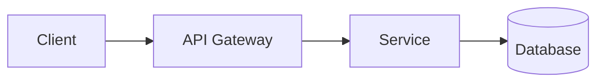
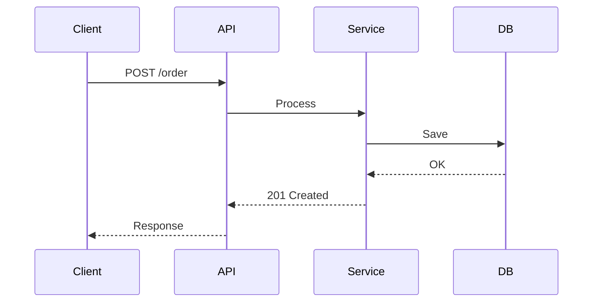
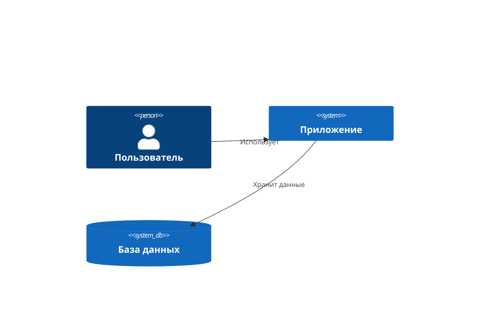

# Mermaid Diagrams

Стандартные диаграммы для архитектурной документации.

## Flowchart — компоненты и связи



## Sequence — последовательность операций



## C4 Context — система в целом



## Deployment — инфраструктура

```mermaid
deployment-beta
    docker-bridge network
    container "api" as api["API Service"]
    container "worker" as worker["Worker"]
    database "postgres" as db[(PostgreSQL)]
    
    api --> worker
    worker --> db
```

## Architecture — компоненты


## Чеклист

- [ ] Все связи подписаны
- [ ] Нет пересечений линий
- [ ] Компоненты одного уровня на одном уровне
- [ ] Цвета однотипных компонентов одинаковые