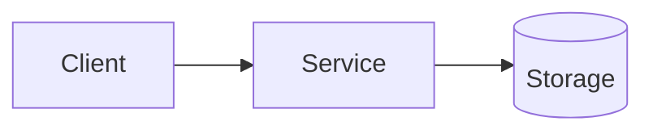

# Option [X]: [Технология]

## Architecture

## Implementation

[Описание как встроить эту технологию в систему]

## Parameters (for ADR)

| Parameter | Value | Source |
|-----------|-------|--------|
| Latency | N ms | Benchmark |
| Throughput | N msg/sec | Benchmark |
| Cost | $N/month | Cloud estimate |

## Pros
- [Плюс 1]
- [Плюс 2]

## Cons
- [Минус 1]
- [Минус 2]
