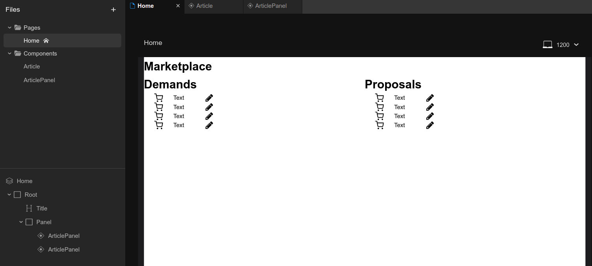

# 202602-ok-marketplace

Учебный проект курса
[Kotlin Backend Developer](https://otus.ru/lessons/kotlin/).
Поток курса 2026-02.

Marketplace -- это площадка, на которой пользователи выставляют предложения и потребности. Задача
площадки -- предоставить наиболее подходящие варианты в обоих случаях: для предложения -- набор вариантов с
потребностями, для потребностей -- набор вариантов с предложениями.

## Визуальная схема фронтенда

## Документация

1. Маркетинг и аналитика
    1. [Бизнес-документация](./docs/01-biz/README.md)

# Структура проекта

## Подпроекты для занятий по языку Kotlin

1. Модуль 1: Введение в Kotlin
    1. [m1l1-first](lessons/m1l1-first) - Вводное занятие, создание первой программы на Kotlin
    2. [m1l2-basic](lessons/m1l2-basic) - Основные конструкции Kotlin
    3. [m1l3-func](lessons/m1l3-func) - Функциональные элементы Kotlin
    4. [m1l4-oop](lessons/m1l4-oop) - Объектно-ориентированное программирование
2. Модуль 2: Расширенные возможности Kotlin
    1. [m2l1-dsl](lessons/m2l1-dsl) - Предметно ориентированные языки (DSL)
    2. [m2l2-coroutines](lessons/m2l2-coroutines) - Асинхронное и многопоточное программирование с корутинами
    3. [m2l3-flows](lessons/m2l3-flows) - Асинхронное и многопоточное программирование с Sequence и Flow
    4. [m2l4-kmp](lessons/m2l4-kmp) - Мультиплатформенная разработка
    5. m2l5 - Интероперабельность Kotlin с другими языками
        1. [m2l5-1-interop](lessons/m2l5-1-interop) - Интероперабельность Kotlin Native с C
        2. [m2l5-2-jni](lessons/m2l5-2-jni) - Интероперабельность Kotlin JVM с C
3. Модуль 3: Подготовка к разработке

### Плагины Gradle сборки проекта

1. [build-plugin](build-plugin) Модуль с плагинами
2. [BuildPluginJvm](build-plugin/src/main/kotlin/BuildPluginJvm.kt) Плагин для сборки проектов JVM
2. [BuildPluginMultiplarform](build-plugin/src/main/kotlin/BuildPluginMultiplatform.kt) Плагин для сборки
   мультиплатформенных проектов

## Проектные модули

### Транспортные модели, API

