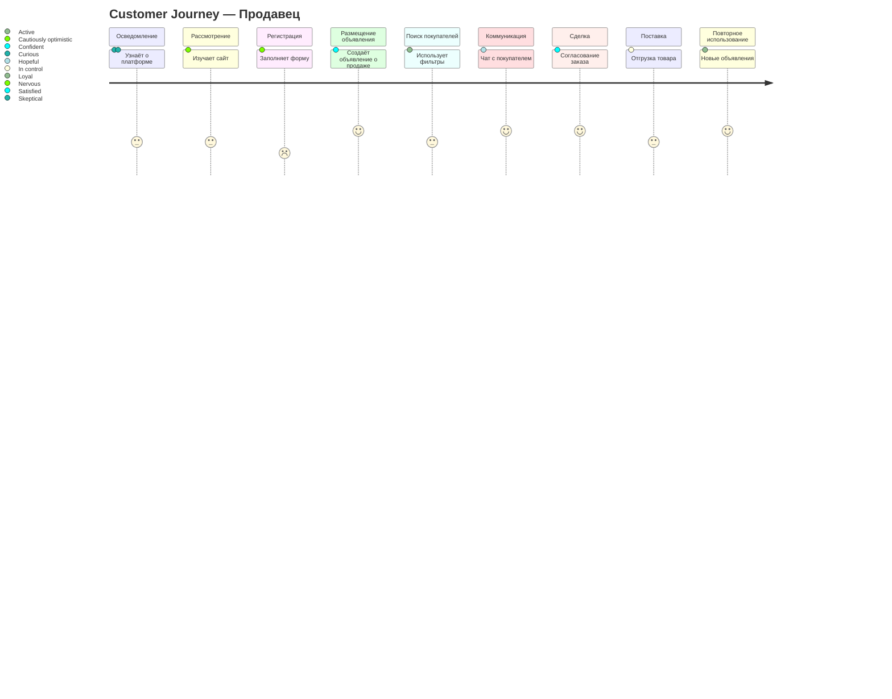
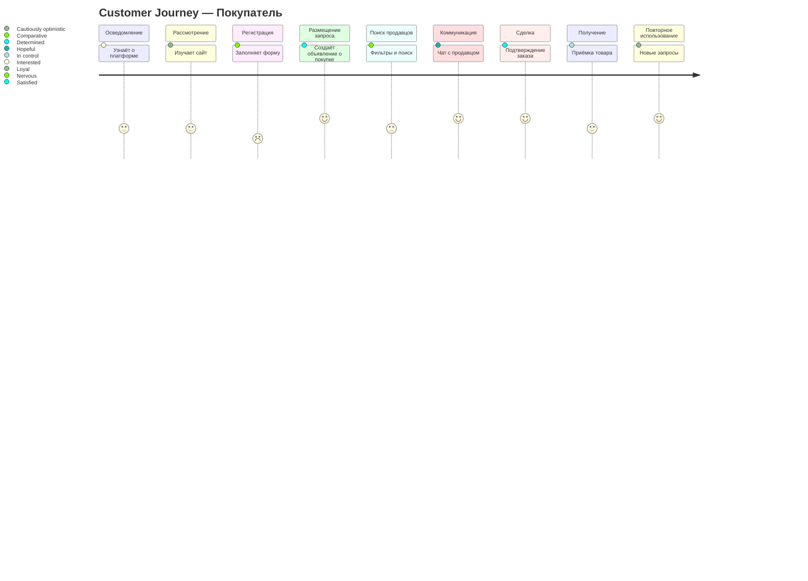

# Customer Journey Map — OK-Marketplace

## 📋 Статус

| Параметр | Значение |
|----------|----------|
| **Статус** | ✅ Утверждено |
| **Дата утверждения** | 2026-04-13 |

---

## Mermaid Диаграмма — Путь Продавца

---

## Mermaid Диаграмма — Путь Покупателя

---

## Customer Journey Map — Продавец

### Этапы и Детали

| Этап | Действие | Эмоция | Pain Points | Gains |
|------|----------|--------|-----------|---------|
| **Осведомление** | Узнаёт о платформе через рекламу, коллег, поиск в интернете | Любопытство, скептицизм | Не знает, насколько платформа эффективна для промышленных компонентов | Возможность найти новых клиентов без посредников |
| **Рассмотрение** | Изучает сайт, читает отзывы, сравнивает с конкурентами | Осторожный оптимизм | Не уверен в надёжности площадки, мало отзывов | Прозрачные условия, специализация на B2B |
| **Регистрация** | Заполняет форму: email, пароль, роль "продавец", компания | Волнение | Требуется верификация, непонятно сколько займёт | Безопасная регистрация с подтверждением email |
| **Размещение объявления** | Создаёт объявление о продаже: категория, описание, цена, фото | Уверенность | Сложно правильно классифицировать компонент, нужно описание | Быстрое размещение, видимость для покупателей |
| **Поиск покупателей** | Использует фильтры, просматривает объявления о покупке | Активность | Много нерелевантных запросов, конкуренция | Доступ к базе покупателей, аналитика спроса |
| **Коммуникация** | Чат с покупателем, обсуждение деталей, отправка КП | Надежда | Барьер языка (технические термины), разница во времени | Прямая связь без посредников, быстрые ответы |
| **Сделка** | Подтверждение заказа, согласование условий | Удовлетворение | Юридические нюансы, оплата | Гарантированная сделка, история в системе |
| **Поставка** | Отгрузка, отслеживание доставки | Контроль | Логистика, таможня (если международная) | Прозрачный трекинг, надёжная доставка |
| **Повторное использование** | Размещает новые объявления, рекомендует коллегам | Лояльность | Нужно постоянно обновлять каталог | Повторные продажи, бонусная программа |

---

## Customer Journey Map — Покупатель

### Этапы и Детали

| Этап | Действие | Эмоция | Pain Points | Gains |
|------|----------|--------|-----------|---------|
| **Осведомление** | Узнаёт о платформе через рекламу, коллег, поиск в интернете | Интерес | Не знает, есть ли нужные компоненты | Большая база поставщиков |
| **Рассмотрение** | Изучает сайт, читает отзывы, проверяет наличие нужных компонентов | Осторожный оптимизм | Качество компонентов неизвестно, нет поставщиков в регионе | Специализация на промышленных компонентах |
| **Регистрация** | Заполняет форму: email, пароль, роль "покупатель", компания | Волнение | Требуется верификация, корпоративные клиенты | Безопасная регистрация, доступ к расширенным профилям |
| **Размещение запроса** | Создаёт объявление о покупке: что нужно, количество, бюджет | Определённость | Сложно указать точные характеристики, нужна спецификация | Быстрый сбор предложений от продавцов |
| **Поиск продавцов** | Фильтры, поиск по категориям, просмотр профилей | Сравнение | Много предложений, сложно выбрать, нужна проверка | Рейтинг продавцов, отзывы, проверка контрагента |
| **Коммуникация** | Чат с продавцом, уточнение деталей, запрос спецификаций | Надежда | Технические вопросы, согласование сроков | Прямая связь, возможность запросить документы |
| **Сделка** | Подтверждение заказа, оплата, согласование доставки | Удовлетворение | Оплата, гарантии, риск мошенничества | Защищённая сделка, история в системе |
| **Получение** | Приёмка, проверка качества, оприходование | Контроль | Проверка соответствия, возможный брак | Гарантия качества, возможность оставить отзыв |
| **Повторное использование** | Размещает новые запросы, рекомендует коллегам | Лояльность | Нужно постоянно искать новых поставщиков | Проверенные поставщики, повторные заказы |

---

## 🎯 Ключевые точки контакта (Touchpoints)

### Для Продавца:
1. **Главная страница** — первый визуальный контакт
2. **Форма регистрации** — барьер входа
3. **Создание объявления** — ключевое действие
4. **Чат** — основная коммуникация
5. **Профиль** — репутация

### Для Покупателя:
1. **Главная страница** — первый визуальный контакт
2. **Поиск** — основной инструмент
3. **Профиль продавца** — проверка надёжности
4. **Чат** — переговоры
5. **Оформление заказа** — завершение цикла

---

## 📊 Метрики Journey

| Метрика | Описание | Целевое значение |
|---------|---------|----------------|
| **Time to First Action** | Время от регистрации до первого действия | < 10 минут |
| **Conversion Rate** | Процент зарегистрировавшихся, совершивших сделку | > 10% |
| **Churn Rate** | Процент пользователей, покинувших платформу | < 20% |
| **NPS** | Net Promoter Score | > 50 |

---

**Дата документа:** 2026-04-13
**Статус:** Утверждено