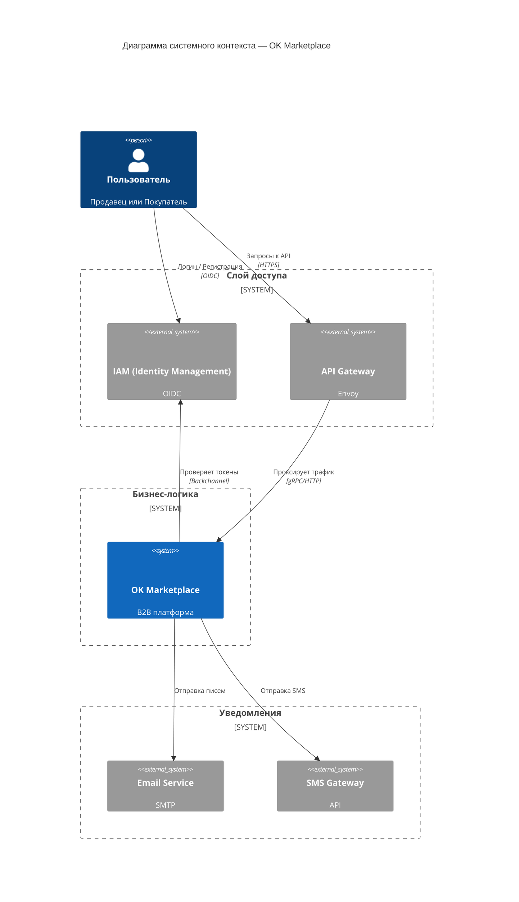
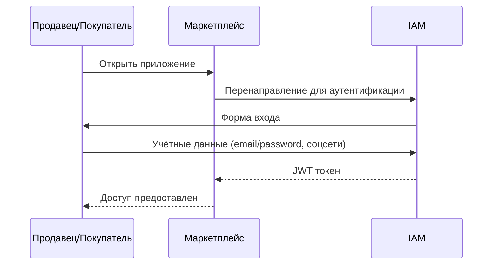
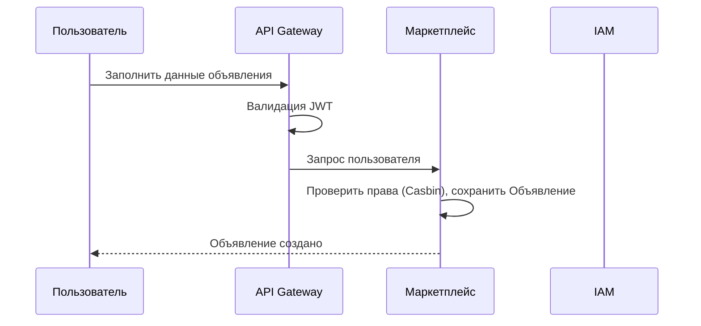

# C4-1: Диаграмма системного контекста

**Уровень:** System Context (C4-1)  
**Система:** OK Marketplace  
**Версия:** 3.0  
**Дата:** 2026-03-26  
**Статус:** Готово к review

---

## 1. Обзор системы

OK Marketplace — это B2B-платформа для торговли промышленными компонентами.

**Назначение:** Платформа соединяет продавцов (поставщиков компонентов) с покупателями (производственными компаниями),
обеспечивая интеллектуальное сопоставление спроса и предложения.

**Ключевые возможности:**

- Регистрация и аутентификация пользователей
- Создание и управление объявлениями (ads)
- Каталог и поиск по объявлениям

**Границы системы:** Всё, что находится под контролем команды разработки OK Marketplace.

---

## 2. Пользователи

### 2.1 Продавец

| Атрибут                | Описание                                                                         |
|------------------------|----------------------------------------------------------------------------------|
| **Роль**               | Продавец                                                                         |
| **Тип**                | B2B                                                                              |
| **Представители**      | Производители двигателей, дистрибьюторы электроники, специализированные продавцы |
| **Цель использования** | Размещение предложений, получение откликов от покупателей, заключение сделок     |

### 2.2 Покупатель

| Атрибут                | Описание                                                                     |
|------------------------|------------------------------------------------------------------------------|
| **Роль**               | Покупатель                                                                   |
| **Тип**                | B2B                                                                          |
| **Представители**      | Производственные компании, интеграторы, ремонтные службы, малое производство |
| **Цель использования** | Создание запросов, поиск релевантных предложений, заключение сделок          |

**Важно:** Любой пользователь **всегда** может выступать как в роли продавца, так и покупателя.

---

## 3. Внешние системы

### 3.1 IAM (на базе Casdoor)

| Атрибут        | Описание                                                      |
|----------------|---------------------------------------------------------------|
| **Название**   | Управление пользователями/IAM                                 |
| **Тип**        | Внешний сервис                                                |
| **Назначение** | Провайдер аутентификации и управления пользователями          |
| **Функции**    | Управление пользователями, организации, OIDC, SSO, выпуск JWT |
| **Протокол**   | HTTPS / API                                                   |

### 3.2 Почтовый сервис

| Атрибут        | Описание                                                                 |
|----------------|--------------------------------------------------------------------------|
| **Название**   | Почтовый сервис (Email Provider)                                         |
| **Тип**        | Внешний сервис                                                           |
| **Назначение** | Отправка email-уведомлений                                               |
| **Сценарии**   | Регистрация, смена пароля, уведомления о сделках, маркетинговые рассылки |
| **Протокол**   | SMTP / API                                                               |

### 3.3 SMS-шлюз

| Атрибут        | Описание                                   |
|----------------|--------------------------------------------|
| **Название**   | SMS-шлюз                                   |
| **Тип**        | Внешний сервис                             |
| **Назначение** | Отправка SMS-сообщений                     |
| **Сценарии**   | Подтверждение OTP, критические уведомления |
| **Протокол**   | API                                        |

---

## 4. Диаграмма System Context

---

## 5. Потоки данных

### 5.1 Регистрация и аутентификация

### 5.2 Создание объявления

---

## 6. Границы системы

| Зона              | Компоненты                                                  | Ответственность                                  |
|-------------------|-------------------------------------------------------------|--------------------------------------------------|
| **Внутри границ** | Маркетплейс (микросервисы), Шлюз, Управление пользователями | Полный контроль команды разработки               |
| **Вне границ**    | Почтовый сервис, SMS-шлюз                                   | Внешние зависимости, неподконтрольные компоненты |

---

## 7. Ключевые допущения

1. **Универсальная роль пользователя** — В MVP один пользователь может выступать как в роли продавца, так и покупателя.

---

*Document Version: 3.0*  
*Created: 2026-03-26*  
*Status: Готово к review*  
*Changes: Переработана диаграмма System Context — удалён Gateway как деталь реализации; документ сосредоточен на
пользователях, системе и внешних интеграциях*
