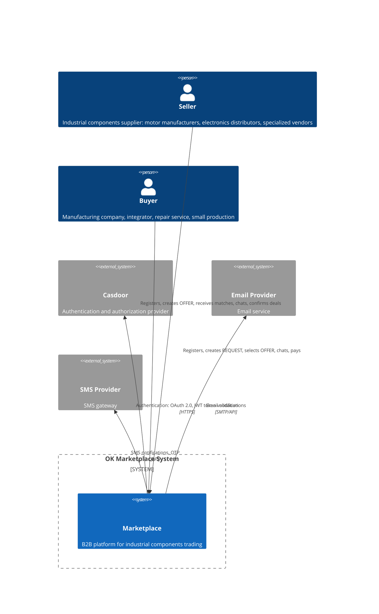
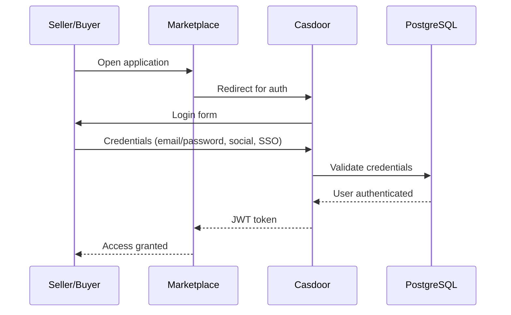
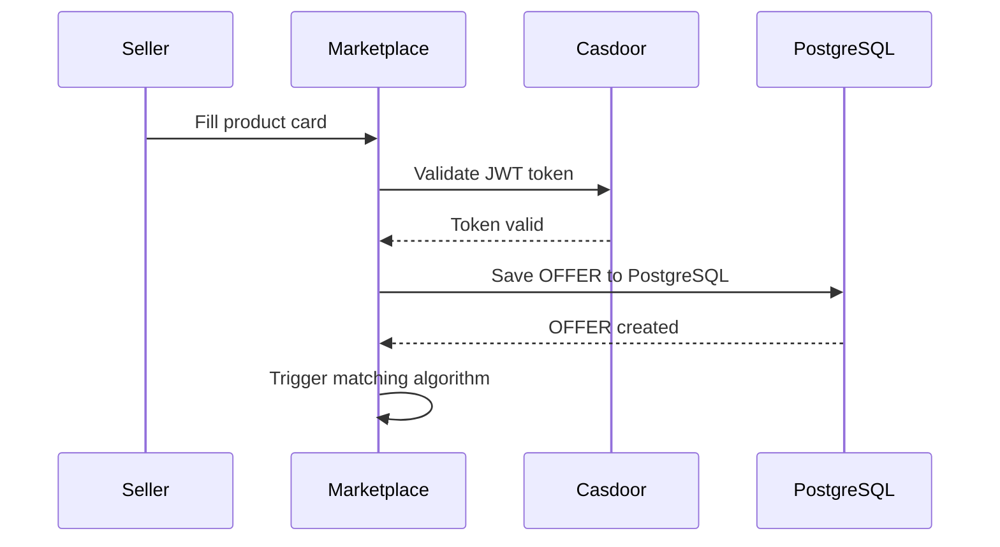
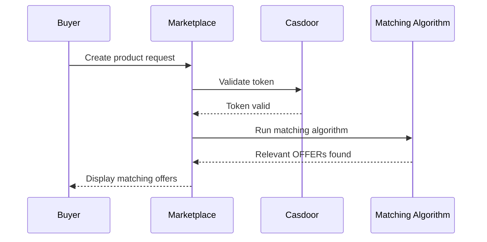
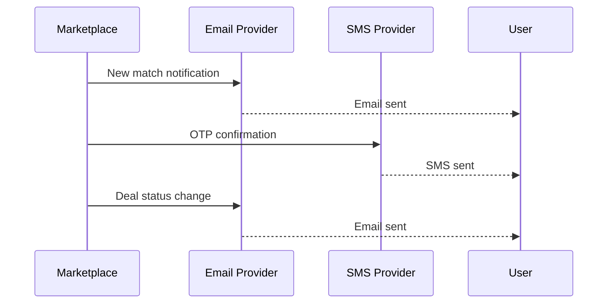
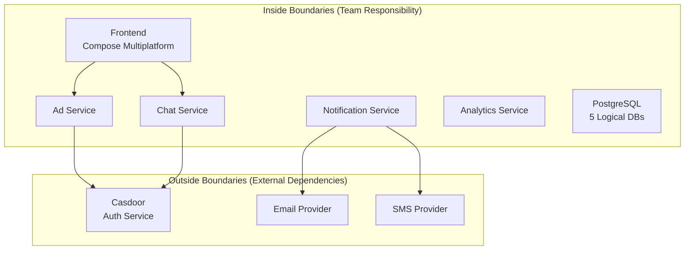
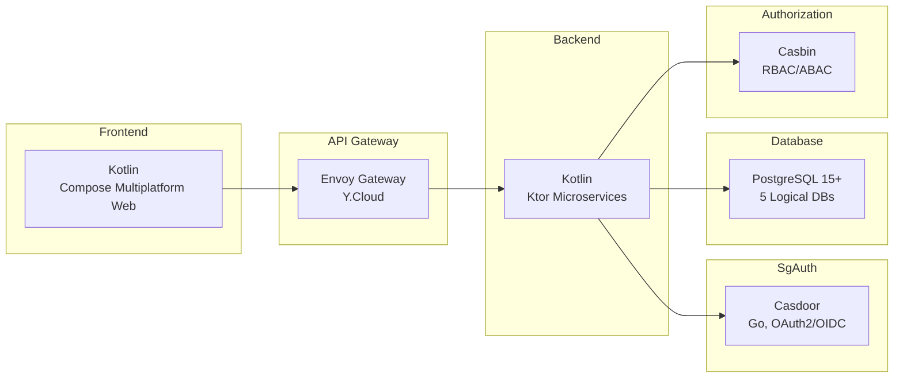
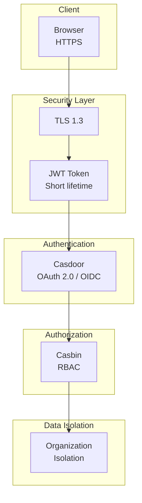

# C4-1: System Context Diagram — Контекст системы

## Уровень 1: System Context Diagram

## Data Flows

### Flow 1: Registration and Authentication

### Flow 2: Create OFFER (Seller)

### Flow 3: Create REQUEST (Buyer)

### Flow 4: Notifications

## System Boundaries

## Technology Stack at System Level

## Security Architecture

---

*Document Version: 1.0*
*Created: 2026-03-24*
*Status: Ready for review*
