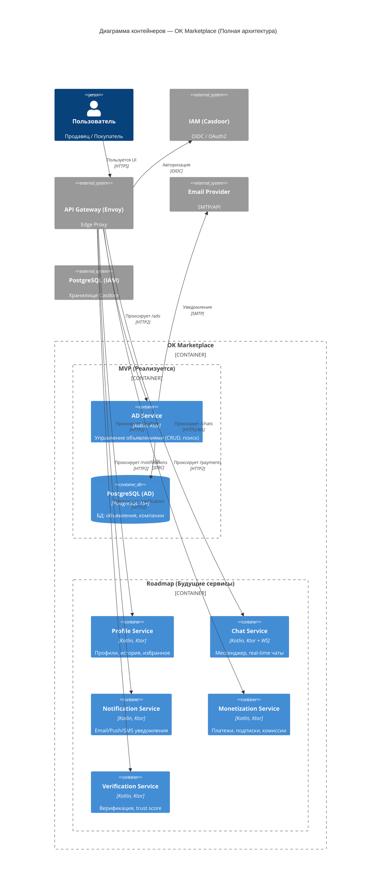
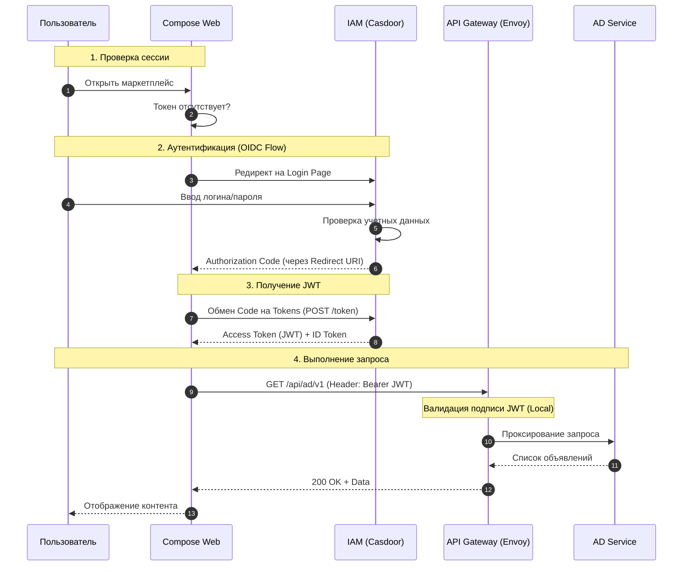
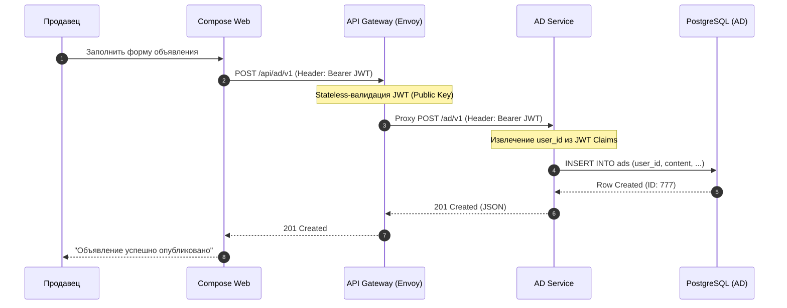
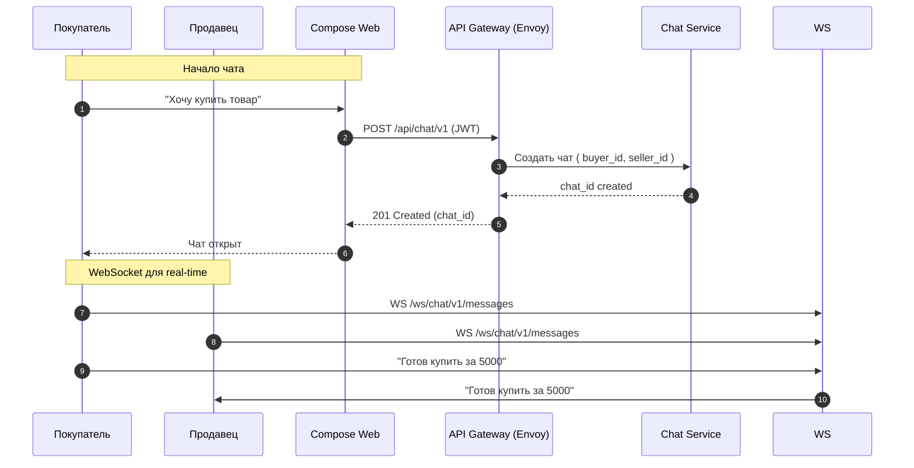
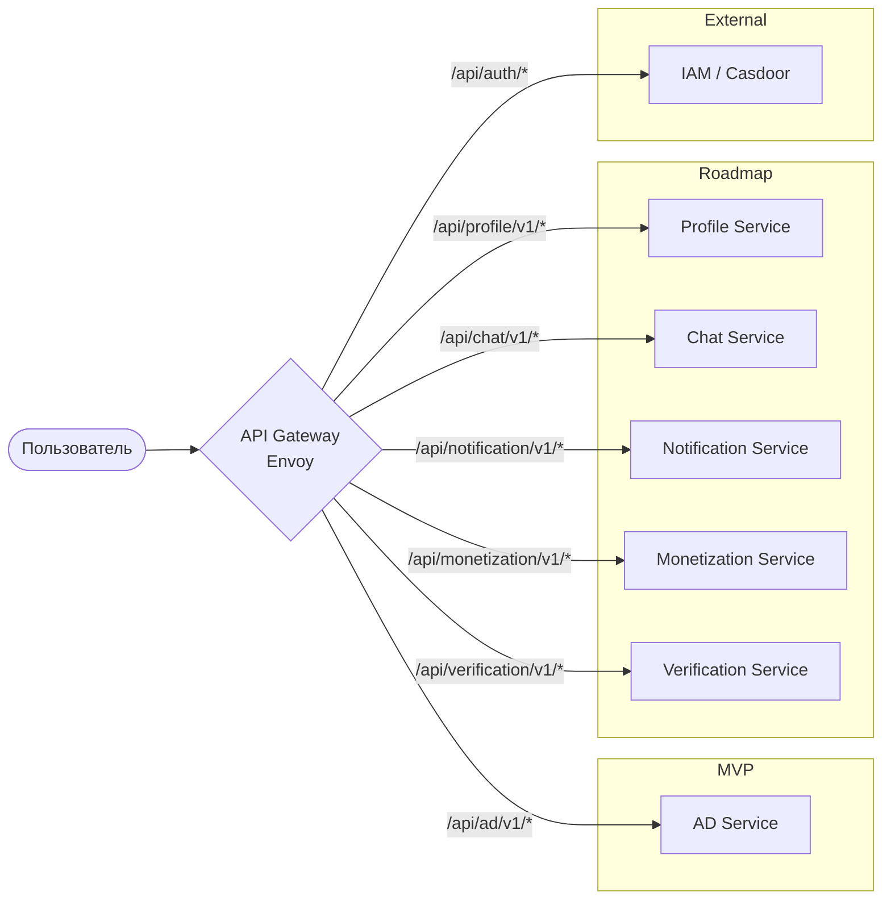

# C4-2: Диаграмма контейнеров

**Уровень:** Container (C4-2)  
**Система:** OK Marketplace  
**Версия:** 4.0  
**Дата:** 2026-03-26  
**Статус:** Готово к review

---

## 1. Обзор

Данный документ описывает архитектуру контейнеров системы OK Marketplace — полная архитектура микросервисов.

**Состав системы:**

### MVP (реализуется сейчас)

| № | Микросервис      | Тип        | Назначение                                 | Статус |
|---|------------------|------------|--------------------------------------------|--------|
| 1 | AD Service       | Microservice | Управление объявлениями (CRUD, поиск)      | MVP    |

### Roadmap (будущие сервисы)

| № | Микросервис            | Тип          | Назначение                                   | Статус   |
|---|------------------------|--------------|----------------------------------------------|----------|
| 2 | Profile Service       | Microservice | Управление профилями пользователей           | Roadmap  |
| 3 | Chat Service          | Microservice | Мессенджер между продавцом и покупателем    | Roadmap  |
| 4 | Notification Service  | Microservice | Отправка push/email/SMS уведомлений          | Roadmap  |
| 5 | Monetization Service  | Microservice | Платежи, подписки, комиссии                  | Roadmap  |
| 6 | Verification Service  | Microservice | Верификация документов, рейтинг продавцов    | Roadmap  |

---

## 2. Контейнеры

### 2.1 API Gateway (Envoy)

| Атрибут              | Описание                                                                              |
|----------------------|--------------------------------------------------------------------------------------|
| **Название**         | API Gateway                                                                          |
| **Тип**              | Контейнер (шлюз)                                                                    |
| **Технология**       | Envoy Proxy                                                                          |
| **Назначение**       | Единая точка входа; маршрутизация запросов; балансировка нагрузки; валидация JWT    |
| **Порт**             | 443 (HTTPS/HTTP2)                                                                    |
| **Протоколы**       | HTTP/2, WebSocket                                                                    |
| **Ответственность**  | - Аутентификация запросов<br>- Маршрутизация к сервисам<br>- Rate limiting<br>- Логирование |

### 2.2 AD Service

| Атрибут              | Описание                                                                              |
|----------------------|--------------------------------------------------------------------------------------|
| **Название**         | AD Service                                                                           |
| **Тип**              | Микросервис (Kotlin, Ktor)                                                          |
| **Назначение**       | Управление объявлениями (ads): создание, чтение, обновление, удаление, поиск        |
| **Порт**             | 8080                                                                                 |
| **Статус**           | **MVP** — реализуется сейчас                                                         |
| **Ответственность**  | - CRUD-операции с объявлениями (ads)<br>- Валидация данных<br>- Полнотекстовый поиск<br>- Фильтрация и сортировка |

**API Endpoints:**

```
AD Service
└── /api/ad/v1
```

### 2.3 Profile Service

| Атрибут              | Описание                                                                              |
|----------------------|--------------------------------------------------------------------------------------|
| **Название**         | Profile Service                                                                      |
| **Тип**              | Микросервис                                                                          |
| **Технология**       | Kotlin, Ktor                                                                         |
| **Назначение**       | Управление профилями пользователей, аватарки, история просмотров, избранное          |
| **Порт**             | 8081                                                                                 |
| **Статус**           | **Roadmap**                                                                          |
| **Ответственность**  | - Профиль пользователя (имя, фото, bio)<br>- История просмотров<br>- Избранные объявления<br>- Настройки уведомлений |

**API Endpoints:**

```
Profile Service
└── /api/profile/v1
```

### 2.4 Chat Service

| Атрибут              | Описание                                                                              |
|----------------------|--------------------------------------------------------------------------------------|
| **Название**         | Chat Service                                                                         |
| **Тип**              | Микросервис                                                                          |
| **Технология**       | Kotlin, Ktor + WebSocket                                                             |
| **Назначение**       | Мессенджер для коммуникации между продавцом и покупателем                           |
| **Порт**             | 8082                                                                                 |
| **Статус**           | **Roadmap**                                                                          |
| **Ответственность**  | - Чат-комнаты между пользователями<br>- Сообщения (текст, фото)<br>- WebSocket для real-time<br>- Уведомления о новых сообщениях |

**API Endpoints:**

```
Chat Service
├── /api/chat/v1          (CRUD чатов)
└── /ws/chat/v1/messages  (WebSocket)
```

### 2.5 Notification Service

| Атрибут              | Описание                                                                              |
|----------------------|--------------------------------------------------------------------------------------|
| **Название**         | Notification Service                                                                |
| **Тип**              | Микросервис                                                                          |
| **Технология**       | Kotlin, Ktor                                                                         |
| **Назначение**       | Централизованная отправка уведомлений различных типов                                |
| **Порт**             | 8083                                                                                 |
| **Статус**           | **Roadmap**                                                                          |
| **Ответственность**  | - Email уведомления<br>- Push-уведомления (FCM/APNs)<br>- SMS<br>- Шаблонизация<br>- Очередь отправки |

**API Endpoints:**

```
Notification Service
└── /api/notification/v1
```

### 2.6 Monetization Service

| Атрибут              | Описание                                                                              |
|----------------------|--------------------------------------------------------------------------------------|
| **Название**         | Monetization Service                                                                 |
| **Тип**              | Микросервис                                                                          |
| **Технология**       | Kotlin, Ktor                                                                         |
| **Назначение**       | Платежи, подписки, комиссии с транзакций, финансовая аналитика                       |
| **Порт**             | 8084                                                                                 |
| **Статус**           | **Roadmap**                                                                          |
| **Ответственность**  | - Обработка платежей (Stripe/ЮKassa)<br>- Подписки (Premium)<br>- Комиссии с продаж<br>- Кошельки пользователей<br>- Вывод средств |

**API Endpoints:**

```
Monetization Service
├── /api/monetization/v1/payments
├── /api/monetization/v1/subscriptions
└── /api/monetization/v1/wallets
```

### 2.7 Verification Service

| Атрибут              | Описание                                                                              |
|----------------------|--------------------------------------------------------------------------------------|
| **Название**         | Verification Service                                                                |
| **Тип**              | Микросервис                                                                          |
| **Технология**       | Kotlin, Ktor                                                                         |
| **Назначение**       | Верификация документов продавцов, рейтинг trust score                                |
| **Порт**             | 8085                                                                                 |
| **Статус**           | **Roadmap**                                                                          |
| **Ответственность**  | - Верификация паспорта/ID<br>- Проверка телефона<br>- Рейтинг продавцов (trust score)<br>- Статус "Проверен"<br>- Споры и арбитраж |

**API Endpoints:**

```
Verification Service
├── /api/verification/v1/verification
├── /api/verification/v1/trust-scores
└── /api/verification/v1/disputes
```

### 2.8 IAM

| Атрибут              | Описание                                                                                                      |
|----------------------|---------------------------------------------------------------------------------------------------------------|
| **Название**         | IAM                                                                                                           |
| **Тип**              | Контейнер (внешний сервис)                                                                                    |
| **Технология**       | Casdoor                                                                                                       |
| **Назначение**       | Провайдер аутентификации; управление пользователями; выпуск JWT                                               |
| **Порт**             | 8000 (внутренний)                                                                                             |
| **Протоколы**       | OIDC / OAuth 2.0                                                                                              |
| **Ответственность**  | - Регистрация и вход пользователей<br>- Управление организациями<br>- Выпуск и валидация JWT-токенов<br>- SSO |

### 2.9 PostgreSQL (AD Service DB)

| Атрибут              | Описание                                                                              |
|----------------------|--------------------------------------------------------------------------------------|
| **Название**         | PostgreSQL — База данных AD Service                                                 |
| **Тип**              | Контейнер (управляемая СУБД)                                                         |
| **Технология**       | PostgreSQL 15+                                                                        |
| **Назначение**       | Персистентное хранение объявлений                                                      |
| **Схема данных**    | ads, companies                                                                       |

### 2.10 PostgreSQL (IAM DB)

| Атрибут              | Описание                                                 |
|----------------------|----------------------------------------------------------|
| **Название**         | PostgreSQL — База данных IAM                             |
| **Тип**              | Контейнер (управляемая СУБД)                             |
| **Технология**       | PostgreSQL 15+                                           |
| **Назначение**       | Хранение пользователей, организаций, сессий, токенов IAM |

---

## 3. Внешние системы

### 3.1 Email Provider

| Атрибут        | Описание                                                           |
|----------------|--------------------------------------------------------------------|
| **Название**   | Email Provider                                                     |
| **Тип**        | Внешний сервис                                                     |
| **Назначение** | Отправка email-уведомлений                                         |
| **Протокол**   | SMTP / API                                                         |
| **Сценарии**   | Регистрация, смена пароля, уведомления о новых объявлениях         |

---

## 4. Диаграмма Container



---

## 5. Потоки данных

### 5.1 Регистрация и аутентификация



### 5.2 Создание объявления (AD)



### 5.3 Чат между продавцом и покупателем (Chat Service — Roadmap)



---

## 6. Маршрутизация API Gateway



---

## 7. Границы масштабирования

### 7.1 Единые точки отказа (SPOF)

| Компонент           | Риск SPOF                     | Митигация                                                   |
|---------------------|-------------------------------|-------------------------------------------------------------|
| API Gateway         | Шлюз недоступен              | Горизонтальное масштабирование (несколько инстансов)       |
| AD Service          | Сервис недоступен            | Горизонтальное масштабирование; health checks              |
| Profile Service     | Сервис недоступен            | Горизонтальное масштабирование                              |
| Chat Service        | Сервис недоступен            | Горизонтальное масштабирование; WebSocket sticky sessions  |
| PostgreSQL (AD)     | База данных недоступна       | Репликация (master-slave или patroni)                      |
| IAM                 | Сервис недоступен            | Кэширование JWT на Gateway; несколько инстансов           |

### 7.2 Узкие места

| Компонент           | Узкое место              | Решение                                                    |
|---------------------|--------------------------|------------------------------------------------------------|
| PostgreSQL          | Запись/чтение при нагрузке | Индексы; read replicas; шардирование (будущее)             |
| Chat Service        | WebSocket соединения    | Connection pooling; Redis для pub/sub                     |
| Notification Queue  | Очередь уведомлений     | Kafka/RabbitMQ для асинхронной обработки                  |
| Monetization Service| PCI DSS compliance      | Вынос платежей в внешний PCI DSS хранилище                |

---

## 8. Ключевые допущения

1. **AD Service — единственный MVP-сервис** — на текущий момент реализуется только AD Service. Остальные сервисы в статусе Roadmap.

2. **Внешний IAM** — IAM на базе Casdoor рассматривается как внешний сервис, развёртываемый отдельно.

3. **Email Provider как внешняя зависимость** — Отправка email делегируется внешнему провайдеру через SMTP/API.

4. **Горизонтальное масштабирование** — Каждый микросервис масштабируется независимо (несколько инстансов за балансировщиком).

5. **Синхронные коммуникации для MVP** — AD Service взаимодействует с БД синхронно. В будущем асинхронные операции (Chat, Notifications) будут вынесены в очереди.

6. **Общая база для MVP** — AD Service имеет собственную PostgreSQL. Прочие сервисы в будущем получат собственные БД или перейдут на sharded/shared решение.

---

## 9. Версионирование API

| Endpoint                  | Сервис              | Версия |
|---------------------------|---------------------|--------|
| /api/ad/v1                | AD Service          | v1     |
| /api/profile/v1           | Profile Service     | v1     |
| /api/chat/v1              | Chat Service        | v1     |
| /api/notification/v1      | Notification Service| v1     |
| /api/monetization/v1      | Monetization Service| v1     |
| /api/verification/v1      | Verification Service| v1     |

---

*Document Version: 4.0*  
*Created: 2026-03-26*  
*Status: Готово к review*  
*Changes: Добавлены Roadmap-сервисы: Profile, Chat, Notification, Monetization, Verification. Полная архитектура микросервисов.*