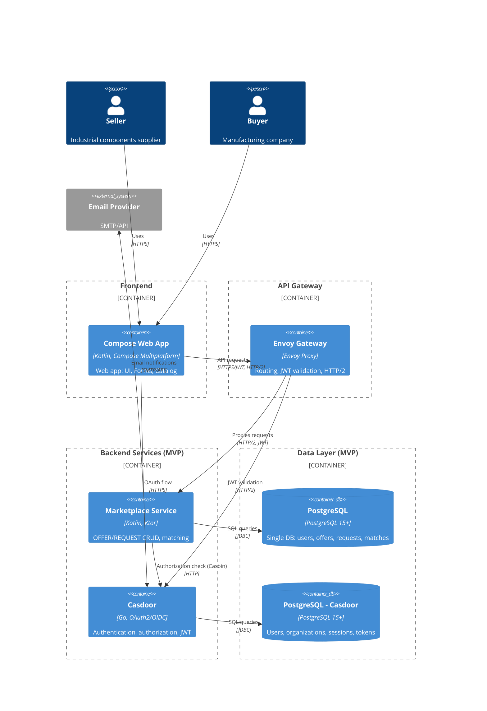
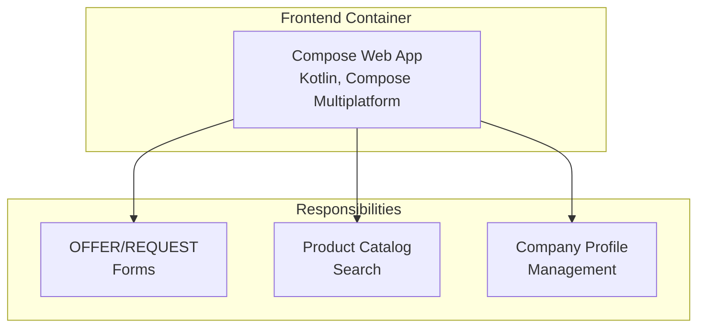
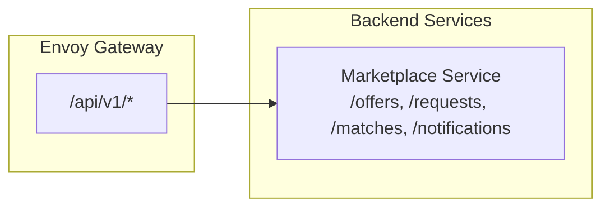
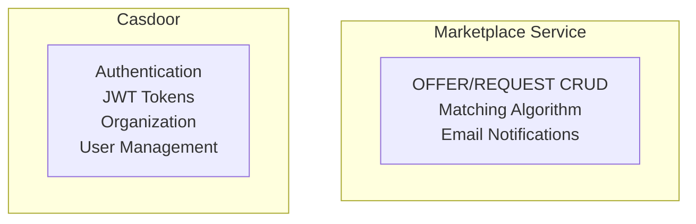
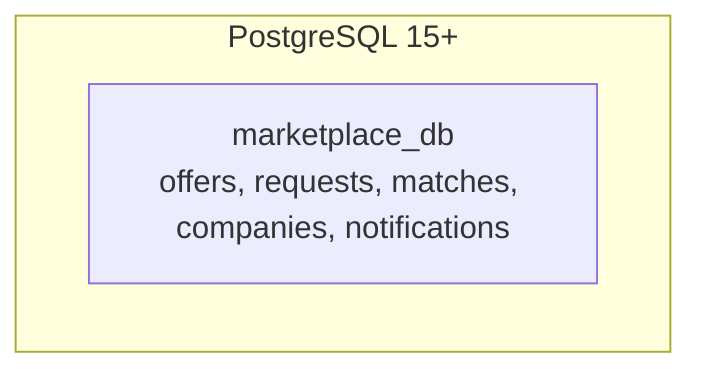
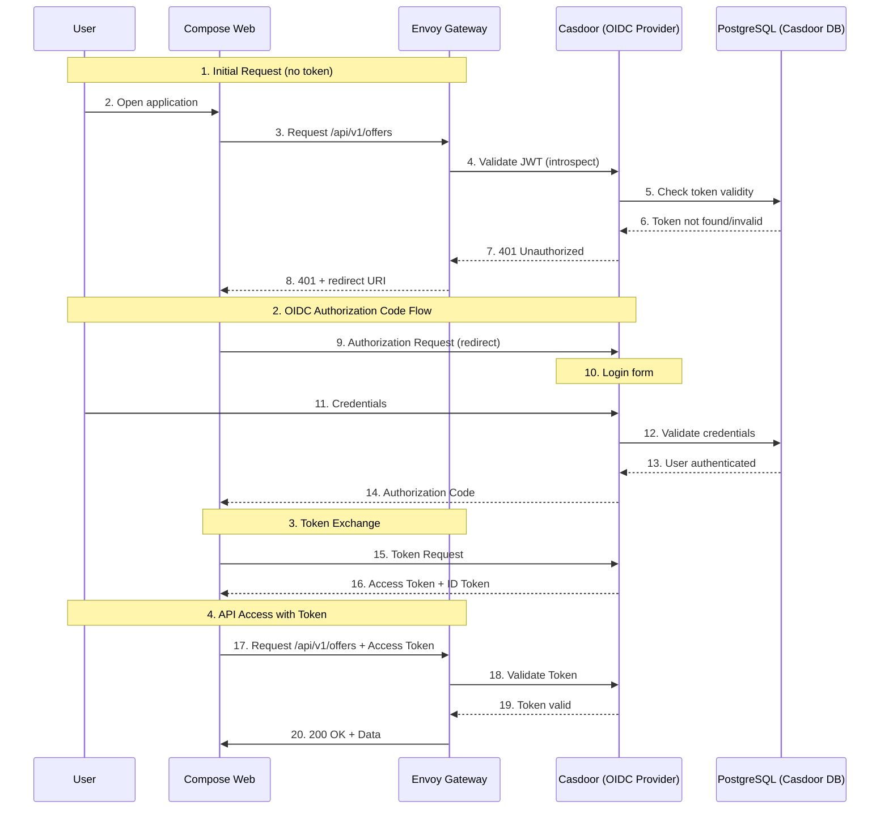
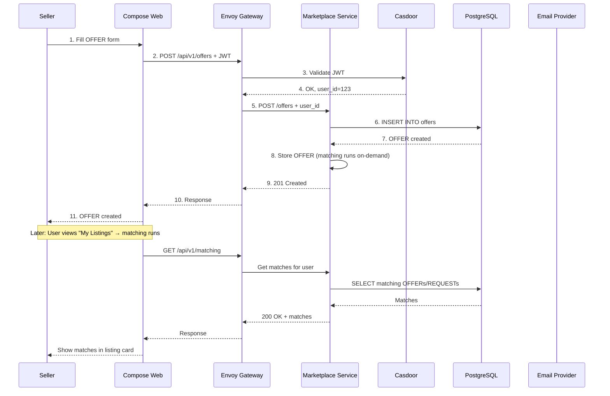
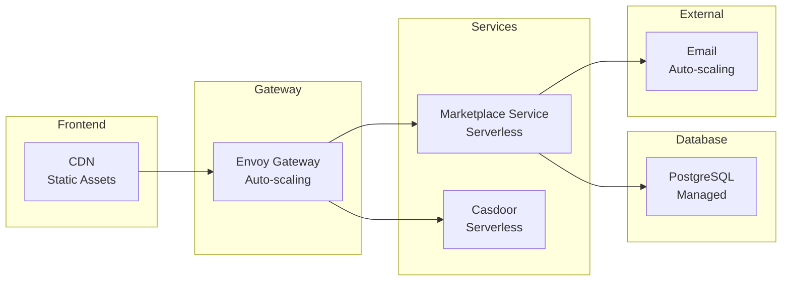

# C4-2: Container Diagram — MVP Architecture

## Level 2: Container Diagram (MVP)

> **Status**: MVP-Optimized (5 Requirements)
> - REQ-001: Registration/Authentication
> - REQ-002: Create OFFER
> - REQ-003: Create REQUEST
> - REQ-004: Matching (On-Demand UI)
> - REQ-005: Catalog & Search



> **Note on HTTP/2**: Using HTTP/2 on Envoy Gateway enables multiplexing, header compression. WebSocket upgrades work over HTTP/2.

## Container Description

### Frontend Responsibilities (MVP)



### API Gateway Routes (MVP)



### Backend Services Responsibilities (MVP)



### Data Layer - Single Database (MVP)



## Key Changes from Full Architecture

| Component | Full Architecture | MVP | Rationale |
|-----------|------------------|-----|------------|
| Services | 5 microservices | 2 services | Chat, Analytics not in MVP |
| Notification | Separate service | Integrated into Marketplace | On-demand UI matching (no email) |
| Databases | 5 logical DBs | 2 DBs (1 app + 1 casdoor) | Cost reduction |
| Chat | Included | Excluded | REQ not in MVP |
| Analytics | Included | Excluded | REQ not in MVP |

## OIDC Authentication Flow (Unchanged)



## Sequence: Create OFFER with Matching



## Deployment Diagram (Y.Cloud Serverless Containers)

```mermaid
graph TB
    subgraph "Y.Cloud Infrastructure"
        subgraph "Serverless Containers"
            F[("Frontend<br/>Compose Web<br/>Static Assets")]
            MS["Marketplace Service<br/>Kotlin/Ktor<br/>Serverless Container"]
            CD["Casdoor<br/>Go<br/>Serverless Container"]
        end
        
        subgraph "Managed Services"
            EG["(Envoy Gateway<br/>Y.Cloud Gateway<br/>HTTP/2, JWT")"]
            DB1["(PostgreSQL<br/>Marketplace DB)"]
            DB2["(PostgreSQL<br/>Casdoor DB)"]
        end
        
        subgraph "External Services"
            EP["Email Provider<br/>SMTP/API"]
        end
    end
    
    Client(("User<br/>Browser")) -->|HTTPS| F
    F -->|HTTP/2, JWT| EG
    EG -->|HTTP/2| MS
    EG -->|HTTP/2| CD
    
    MS -->|JDBC| DB1
    CD -->|JDBC| DB2
    
    MS -->|SMTP| EP
    
    style F fill:#90EE90
    style MS fill:#87CEEB
    style CD fill:#FFB6C1
    style EG fill:#DDA0DD
    style DB1 fill:#F0E68C
    style DB2 fill:#F0E68C
```

**Y.Cloud Serverless Deployment Notes (MVP):**
- Frontend: CDN + Static Hosting
- Marketplace Service: Serverless Container with auto-scaling
- Envoy Gateway: Managed Y.Cloud Gateway
- PostgreSQL: 2 managed DBs (marketplace + casdoor)

## Scalability (MVP)



---

*Document Version: 2.0 (MVP)*
*Created: 2026-03-26*
*Status: Ready for review*
