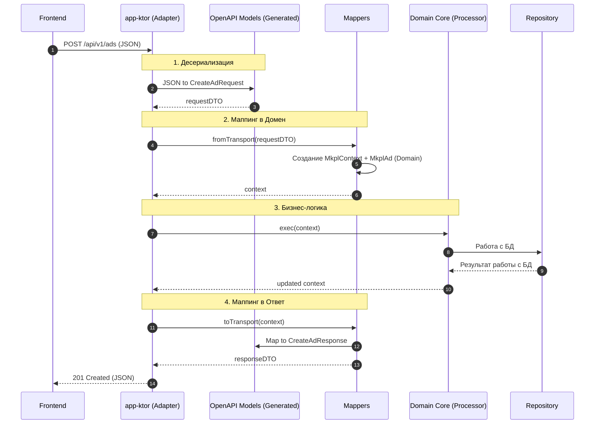
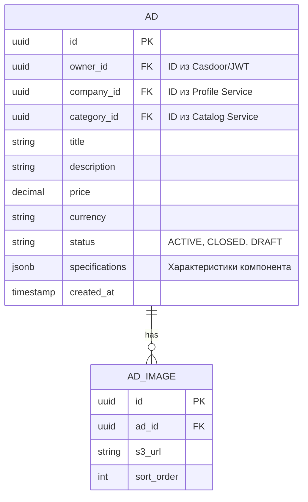

# C4-3: Диаграмма компонентов — MVP

## Уровень 3: Диаграмма компонентов (MVP)

> **Примечание к архитектуре**: Это оптимизировано под MVP. Единый AD-сервис для управления объявлениями.

### 3.1 AD-сервис (MVP)

```mermaid
C4Component
    title Component Diagram — ok-marketplace-be (Domain-Centric)
    Person(client, "Пользователь")
    System_Boundary(infra_db, "Инфраструктура БД") {
        System_Ext(db_postgres, "PostgreSQL")
        System_Ext(db_cassandra, "Cassandra")
        System_Ext(db_arcadedb, "ArcadeDB")
    }
    System_Boundary(infra_mq, "Инфраструктура MQ") {
        System_Ext(kafka, "Kafka")
        System_Ext(rabbit, "RabbitMQ")
    }

    Container_Boundary(be, "ok-marketplace-be") {
        Boundary(adapters_in, "Primary Adapters (Entry Points)") {
            Component(app_ktor, "app-ktor", "Ktor", "Маршрутизация и DI (инициализация)")
            Component(app_spring, "app-spring", "Spring", "Маршрутизация и DI (инициализация)")
            Component(app_kafka, "app-kafka", "Consumer", "Событийная точка входа")
            Component(app_rabbit, "app-rabbit", "Consumer", "Событийная точка входа")
        }

        Boundary(domain_core, "Domain Core (Business Logic)") {
            Component(processor, "MkplAdProcessor", "COR Processor", "Оркестрация бизнес-правил")
            Component(context, "MkplContext", "State", "Единое состояние запроса")
            Component(models, "Domain Models", "Entities", "MkplAd, MkplAdId и др.")
            Component(repo_iface, "IRepoAd", "Interface (Port)", "Порт для работы с данными")
            Component(mappers, "Mappers", "Mapping", "Трансляция API ↔ Domain")
        }

        Boundary(adapters_out, "Secondary Adapters (Infrastructure)") {
            Component(repo_im, "Repo InMemory", "Exposed", "Реализация порта (Cache)")
            Component(repo_pg, "Repo PostgreSQL", "Exposed", "Реализация порта (SQL)")
            Component(repo_cassandra, "Repo Cassandra", "Driver", "Реализация порта (NoSQL)")
            Component(repo_arcadedb, "Repo ArcadeDB", "Driver", "Реализация порта (NoSQL)")
            Component(repo_stubs, "Repo Stubs", "Mocks", "Заглушки для тестов/фронта")
        }

    %%        Component(lib_cor, "lib-cor", "Library", "Движок для цепочек правил")
        Container_Boundary(libs, "Libraries") {
            Component(lib_cor, "lib-cor", "COR Library", "Chain of Responsibility")
        %%            Component(lib_logging, "lib-logging", "lib-logging", "Логирование")
        }

    }

%% Связи
    Rel(client, app_ktor, "REST API")
    Rel(client, app_spring, "REST API")
    BiRel(kafka, app_kafka, "Consume/Publish")
    BiRel(rabbit, app_rabbit, "Consume/Publish")

%% Вход в домен
    Rel(app_ktor, mappers, "1. Mapping")
    Rel(app_ktor, processor, "2. Execution")
%% Внутри домена
    Rel(processor, context, "Modifies")
    Rel(processor, lib_cor, "Uses engine")
    Rel(processor, repo_iface, "Calls (Port)")
    Rel(context, models, "References")
%% DIP: Инфраструктура зависит от домена
    Rel(repo_im, repo_iface, "Implements")
    Rel(repo_pg, repo_iface, "Implements")
    Rel(repo_cassandra, repo_iface, "Implements")
    Rel(repo_arcadedb, repo_iface, "Implements")
    Rel(repo_stubs, repo_iface, "Implements")
    Rel(repo_pg, db_postgres, "JDBC")
    Rel(repo_cassandra, db_cassandra, "JDBC")
    Rel(repo_arcadedb, db_arcadedb, "Gremlin")
```

---

## Поток авторизации

## Схема базы данных (MVP)

---

*Document Version: 4.0 (MVP)*
*Created: 2026-03-26*
*Status: Ready for review*
*Changes: Микрофронтенды перенесены в C4-2 (Container level). Убраны Offer, Request, Match контроллеры/сервисы/репозитории. Оставлен только Ad.*