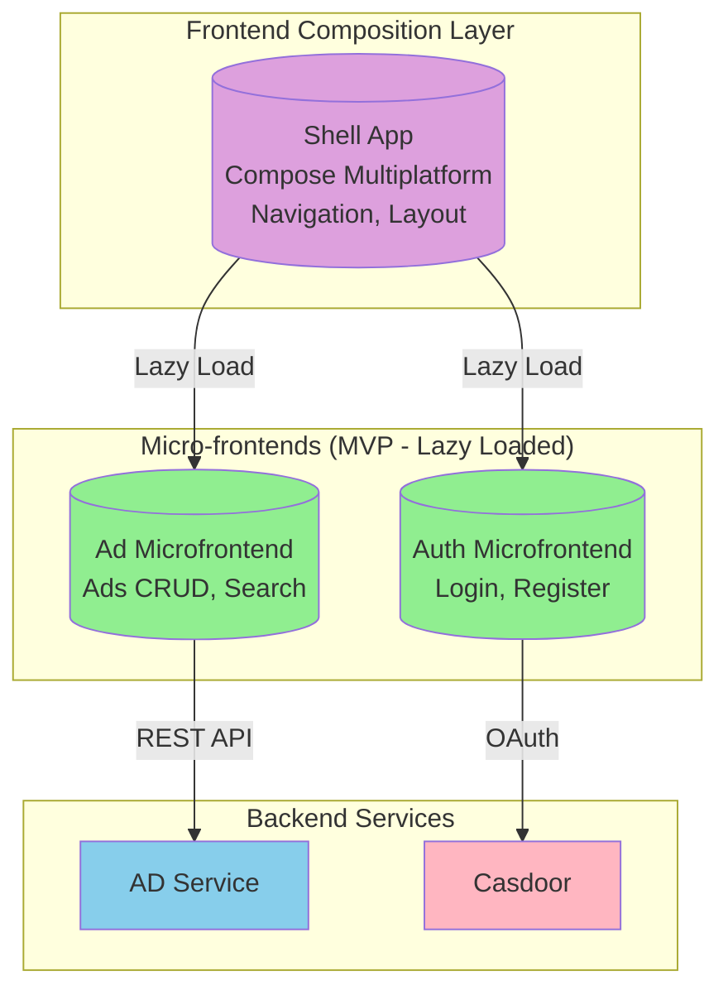
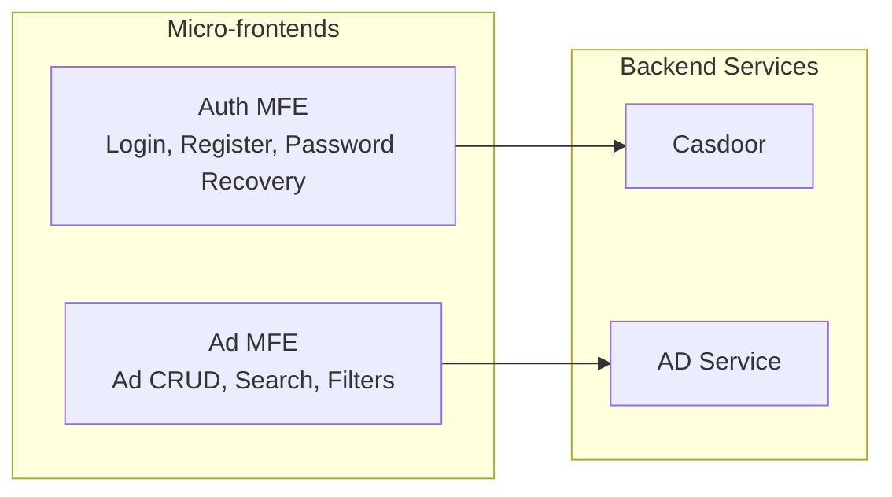
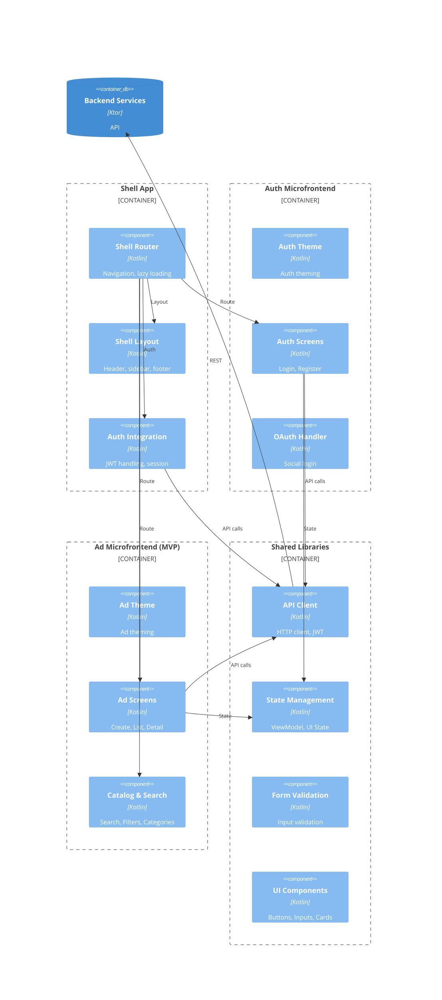
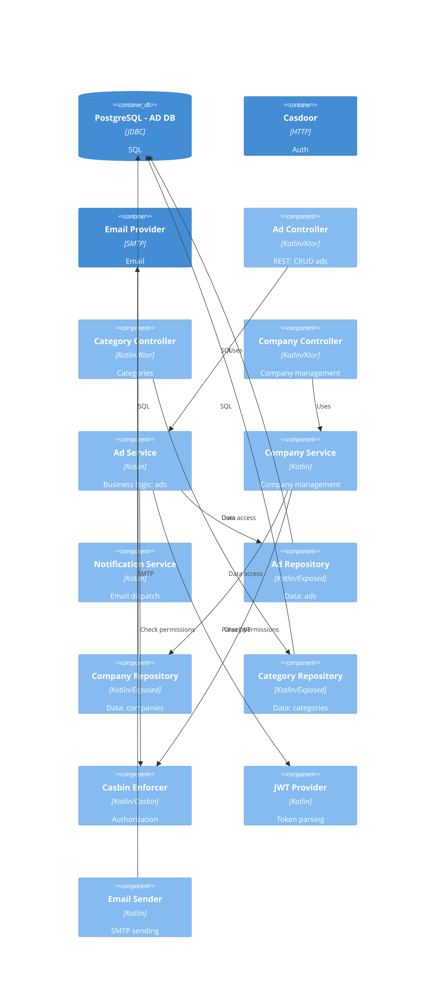
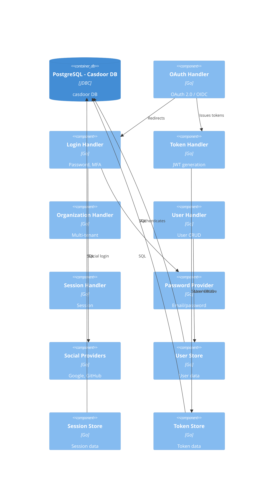
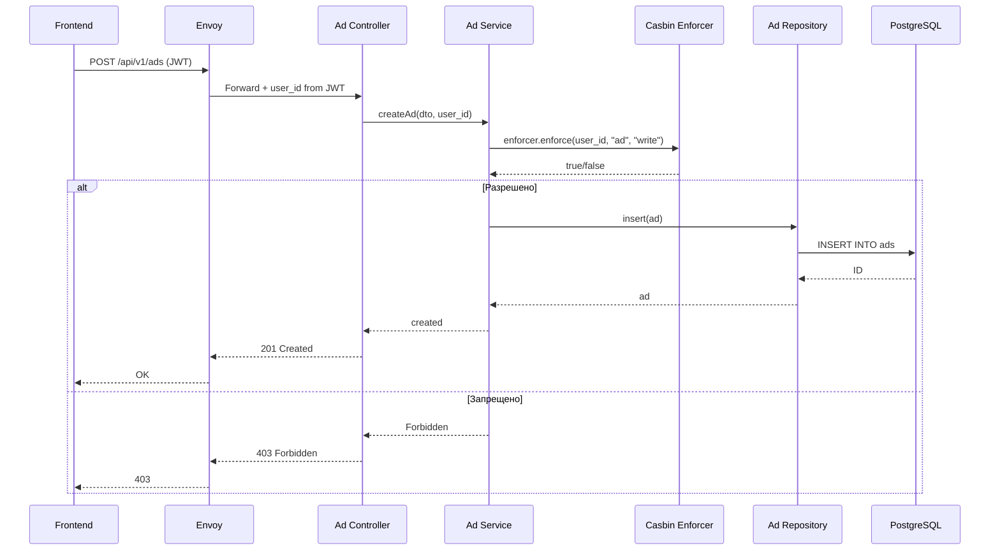
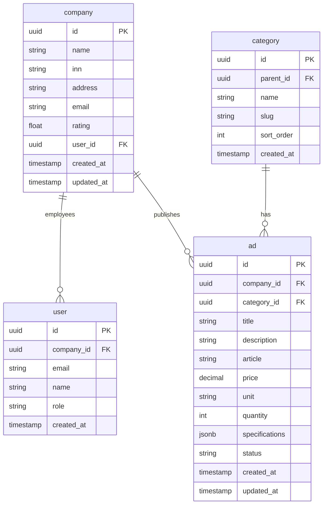

# C4-3: Component Diagram — MVP Architecture

## Level 3: Component Diagrams (MVP)

> **Note on Architecture**: This is MVP-Optimized. Single AD Service for ads management.

### 3.0 Micro-frontends Architecture (MVP)

### Micro-frontends Mapping (MVP)

---

### 3.1 Frontend (Shell + Micro-frontends)

---

### 3.2 AD Service (MVP)

---

### 3.3 Casdoor (Unchanged)

---

## Authorization Flow (Unchanged)

## Database Schema (MVP)

---

## What's NOT in MVP

| Component | Full Architecture | MVP | Notes |
|-----------|------------------|-----|-------|
| Chat Service | ✅ | ❌ | Chat not in MVP |
| Chat MFE | ✅ | ❌ | Chat UI not in MVP |
| Analytics Service | ✅ | ❌ | Stats not in MVP |
| Analytics MFE | ✅ | ❌ | Stats UI not in MVP |
| Notification Service | Separate | Integrated | Merged into AD Service |
| WebSocket Handler | ✅ | ❌ | Real-time not needed |

---

*Document Version: 3.0 (MVP)*
*Created: 2026-03-26*
*Status: Ready for review*
*Changes: Убраны Offer, Request, Match контроллеры/сервисы/репозитории. Оставлен только Ad.*