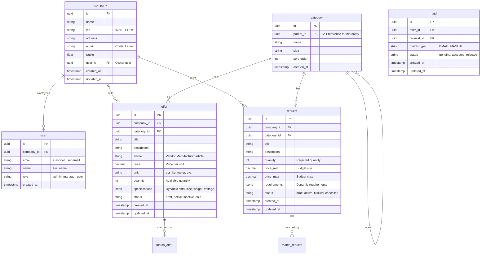
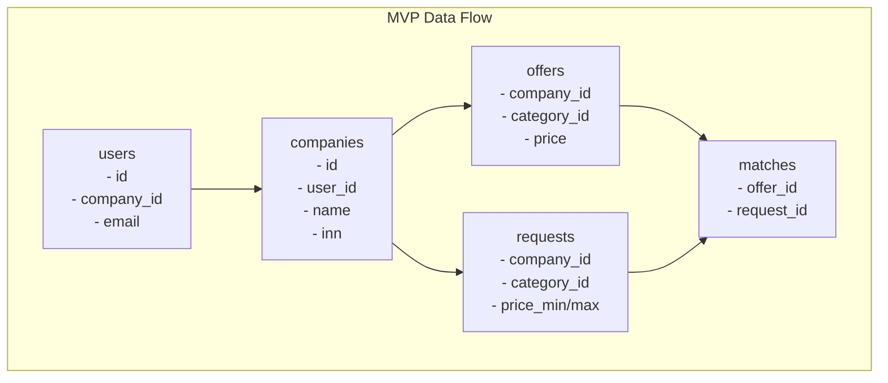

# ERD: Entity Relationship Diagram — MVP Database

## Context

Database schema для MVP B2B маркетплейса (5 требований).

### MVP Tables

| Table | Purpose | REQ |
|-------|---------|-----|
| **companies** | Компании (продавцы/покупатели) | REQ-001 |
| **users** | Пользователи (сотрудники компаний) | REQ-001 |
| **categories** | Категории товаров | REQ-005 |
| **offers** | Объявления о продаже | REQ-002, REQ-005 |
| **requests** | Запросы на закупку | REQ-003, REQ-005 |
| **matches** | Результаты мэтчинга | REQ-004 |

> **Note**: Casdoor хранит своих users, organizations в отдельной БД. Здесь — только marketplace-сущности.

---

## ERD (Mermaid)

---

## Table Definitions

### companies

| Column | Type | Constraints |
|--------|------|-------------|
| id | UUID | PRIMARY KEY |
| name | VARCHAR(255) | NOT NULL |
| inn | VARCHAR(50) | UNIQUE, NOT NULL |
| address | TEXT | |
| email | VARCHAR(255) | NOT NULL |
| rating | DECIMAL(3,2) | DEFAULT 0.00 |
| user_id | UUID | REFERENCES users(id) |
| created_at | TIMESTAMP | DEFAULT CURRENT_TIMESTAMP |
| updated_at | TIMESTAMP | DEFAULT CURRENT_TIMESTAMP |

**Indexes:** idx_companies_inn, idx_companies_email

### users

| Column | Type | Constraints |
|--------|------|-------------|
| id | UUID | PRIMARY KEY |
| company_id | UUID | REFERENCES companies(id) ON DELETE CASCADE |
| email | VARCHAR(255) | NOT NULL |
| name | VARCHAR(255) | |
| role | VARCHAR(50) | DEFAULT 'user' |
| created_at | TIMESTAMP | DEFAULT CURRENT_TIMESTAMP |

**Indexes:** idx_users_email (UNIQUE), idx_users_company

### categories

| Column | Type | Constraints |
|--------|------|-------------|
| id | UUID | PRIMARY KEY |
| parent_id | UUID | REFERENCES categories(id) |
| name | VARCHAR(255) | NOT NULL |
| slug | VARCHAR(100) | UNIQUE, NOT NULL |
| sort_order | INT | DEFAULT 0 |
| created_at | TIMESTAMP | DEFAULT CURRENT_TIMESTAMP |

**Indexes:** idx_categories_parent, idx_categories_slug

### offers

| Column | Type | Constraints |
|--------|------|-------------|
| id | UUID | PRIMARY KEY |
| company_id | UUID | REFERENCES companies(id) ON DELETE CASCADE |
| category_id | UUID | REFERENCES categories(id) |
| title | VARCHAR(500) | NOT NULL |
| description | TEXT | |
| article | VARCHAR(100) | |
| price | DECIMAL(15,2) | NOT NULL |
| unit | VARCHAR(20) | DEFAULT 'pcs' |
| quantity | INT | DEFAULT 0 |
| specifications | JSONB | DEFAULT '{}' |
| status | VARCHAR(20) | DEFAULT 'draft' |
| created_at | TIMESTAMP | DEFAULT CURRENT_TIMESTAMP |
| updated_at | TIMESTAMP | DEFAULT CURRENT_TIMESTAMP |

**Indexes:** idx_offers_company, idx_offers_category, idx_offers_status

**Special indexes:**
- Full-text search: GIN(to_tsvector('russian', title || ' ' || description))
- JSONB: GIN(specifications)
- Matching: composite(category_id, status, price) WHERE status = 'active'

### requests

| Column | Type | Constraints |
|--------|------|-------------|
| id | UUID | PRIMARY KEY |
| company_id | UUID | REFERENCES companies(id) ON DELETE CASCADE |
| category_id | UUID | REFERENCES categories(id) |
| title | VARCHAR(500) | NOT NULL |
| description | TEXT | |
| quantity | INT | NOT NULL |
| price_min | DECIMAL(15,2) | |
| price_max | DECIMAL(15,2) | |
| requirements | JSONB | DEFAULT '{}' |
| status | VARCHAR(20) | DEFAULT 'draft' |
| created_at | TIMESTAMP | DEFAULT CURRENT_TIMESTAMP |
| updated_at | TIMESTAMP | DEFAULT CURRENT_TIMESTAMP |

**Indexes:** idx_requests_company, idx_requests_category, idx_requests_status

**Special indexes:**
- Full-text search: GIN(to_tsvector('russian', title || ' ' || description))
- Matching: composite(category_id, status, price_min, price_max) WHERE status = 'active'

### matches

| Column | Type | Constraints |
|--------|------|-------------|
| id | UUID | PRIMARY KEY |
| offer_id | UUID | REFERENCES offers(id) ON DELETE CASCADE |
| request_id | UUID | REFERENCES requests(id) ON DELETE CASCADE |
| match_type | VARCHAR(20) | DEFAULT 'EMAIL' |
| status | VARCHAR(20) | DEFAULT 'pending' |
| created_at | TIMESTAMP | DEFAULT CURRENT_TIMESTAMP |
| updated_at | TIMESTAMP | DEFAULT CURRENT_TIMESTAMP |

**Constraint:** UNIQUE(offer_id, request_id)

**Indexes:** idx_matches_offer, idx_matches_request, idx_matches_status

---

## Relationships

---

## Sample Data

### Categories (Seed)

**Electronics:**
- Electronics (slug: electronics, sort: 1)
- Sensors (slug: sensors, sort: 2)
- Motors (slug: motors, sort: 3)
- Automation (slug: automation, sort: 4)

**Industrial:**
- Industrial Equipment (slug: industrial, sort: 10)
- Tools (slug: tools, sort: 11)

### Matching Query Example

Поиск REQUESTов,соответствующих OFFER:
- Фильтр по category_id
- Статус = 'active'
- Исключить свою компанию (company_id !=)
- price_min <= offer.price <= price_max
- Исключить уже замэченные (NOT EXISTS в matches)

---

## Evolution Path

| Phase | Tables | Notes |
|-------|--------|-------|
| MVP | 6 tables | Current |
| v1.1 | +ratings | Add ratings/reviews |
| v1.2 | +messages | Add chat (NOT in MVP) |
| v1.3 | +analytics_events | Add analytics (NOT in MVP) |

---

*Document Version: 1.0*
*Created: 2026-03-26*
*Status: Ready for review*
