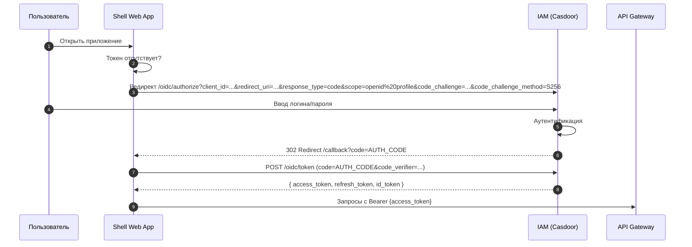
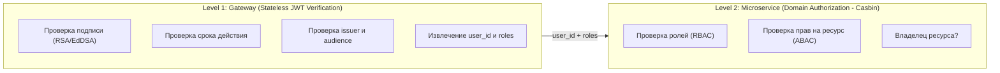
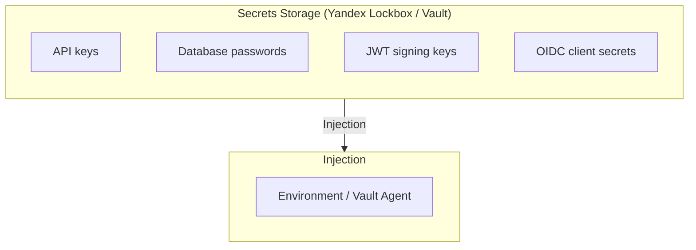
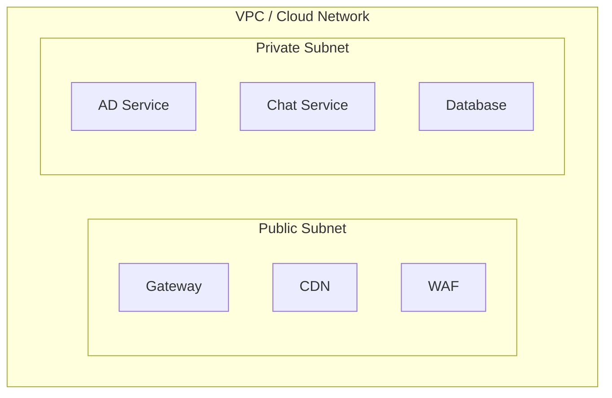
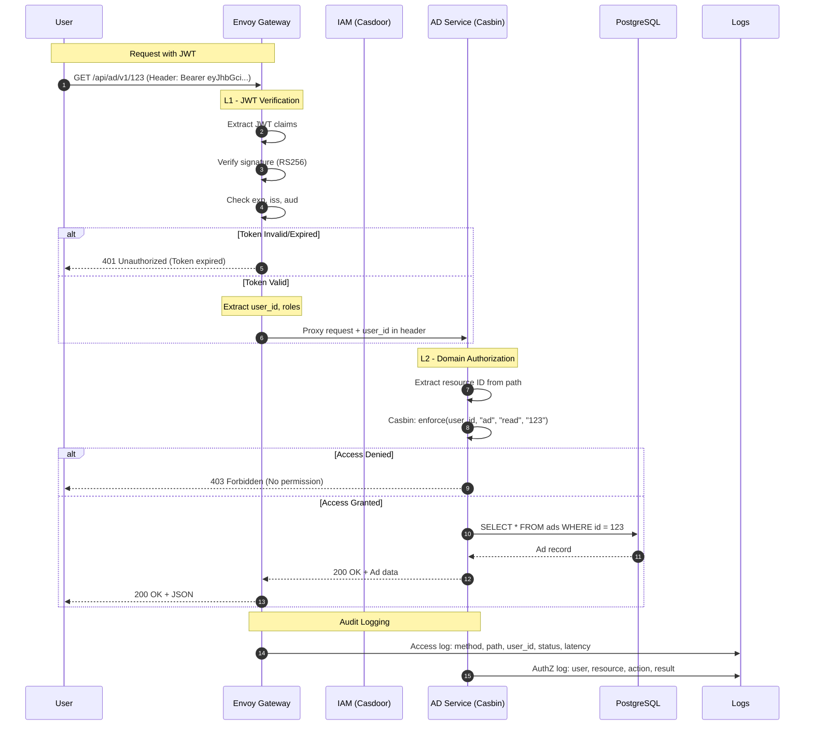

# Архитектура безопасности — OK Marketplace

## 1. Модель угроз (Threat Model)

| Угроза | Описание | Уровень риска | Митигация |
|--------|----------|---------------|-----------|
| **Кража токенов** | Перехват JWT через XSS или MITM | Высокий | Short-lived access tokens; HttpOnly cookies; TLS |
| **Подмена ID пользователя** | Манипуляция с user_id в JWT claims | Средний | Криптографическая верификация JWT на Gateway |
| **Брутфорс** | Подбор пароля на странице входа | Средний | Rate limiting; lockout policy; captcha |
| **CSRF** | Подмена запросов от имени пользователя | Средний | CSRF tokens; SameSite cookies |
| **SQL Injection** | Инъекция в запросы к БД | Высокий | Parameterized queries; ORM |
| **SSRF** | Атака через URL в пользовательском вводе | Средний | Валидация URL; whitelist |
| **DDoS** | Отказ в обслуживании | Высокий | Rate limiting; CDN; WAF |

---

## 2. Аутентификация (AuthN)

### 2.1 OIDC Flow

| Параметр | Значение |
|----------|----------|
| **Flow** | Authorization Code Flow with PKCE |
| **Token Endpoint** | POST /oidc/token (IAM Casdoor) |
| **Grant Type** | authorization_code + pkce |
| **Code Verifier** | SHA-256, 43-128 символов |
| **Code Challenge** | BASE64URL(SHA256(code_verifier)) |

### 2.2 Token Management

| Token | Время жизни | Хранение | Использование |
|-------|-------------|----------|----------------|
| **Access Token** | 15 минут | In-memory / Memory-safe | Авторизация API запросов |
| **Refresh Token** | 30 дней | HttpOnly Secure Cookie | Обновление access token |
| **ID Token** | 15 минут | In-memory | Профиль пользователя |

### 2.3 Authentication Flow



---

## 3. Авторизация (AuthZ)

### 3.1 Двухуровневая модель



### 3.2 Role-Based Access Control (RBAC)

| Роль | Описание | Permitted Actions |
|------|----------|-------------------|
| **guest** | Неавторизованный | Просмотр объявлений |
| **user** | Авторизованный | Создание объявлений, чат |
| **seller** | Продавец | CRUD своих объявлений |
| **moderator** | Модератор | Удаление любых объявлений |
| **admin** | Администратор | Полный доступ |

### 3.3 ABAC Policy Example

```yaml
# Casbin Policy
p, seller, ad, read, owner, equal
p, seller, ad, update, owner, equal
p, seller, ad, delete, owner, equal
p, moderator, ad, delete, *, *
p, admin, *, *, *, *
```

---

## 4. Безопасность данных (Data Security)

### 4.1 Encryption at Rest

| Данные | Шифрование | Ключ |
|--------|-------------|------|
| PostgreSQL (все таблицы) | AES-256-GCM | Yandex Lockbox / KMS |
| S3 (изображения) | Server-side encryption | AWS S3 SSE-KMS |
| Secrets (пароли, ключи) | Encrypted vault | HashiCorp Vault / Yandex Lockbox |

### 4.2 Encryption in Transit

| Компонент | Протокол | Версия |
|-----------|----------|--------|
| Client → Gateway | TLS | 1.2 (min), 1.3 (preferred) |
| Gateway → Service | mTLS (будущее) | 1.3 |
| Service → DB | TLS | 1.2+ |
| Service → External API | TLS | 1.2+ |

### 4.3 Secrets Management



### 4.4 Data Classification

| Категория | Примеры | Защита |
|-----------|---------|--------|
| **Public** | Объявления, названия товаров | Нет ограничений |
| **Private** | Email, phone, имя пользователя | Encryption at rest; Access logging |
| **Sensitive** | Payment info, documents | Encryption; Strict access; Audit |

---

## 5. Сетевая безопасность (Network Security)

### 5.1 Network Isolation



### 5.2 Database Access

| Правило | Описание |
|---------|----------|
| Security Group | Разрешён входящий трафик только с подсети бэкенда |
| Port | Только 5432 (PostgreSQL) |
| Authentication | IAM-based; пароли с ротацией |

### 5.3 CORS Policy

```
Allowed Origins:
  - https://okmarketplace.ru
  - https://www.okmarketplace.ru
  - https://dev.okmarketplace.ru (Development)

Allowed Methods: GET, POST, PUT, DELETE, OPTIONS
Allowed Headers: Authorization, Content-Type, X-Request-ID
Credentials: true
Max Age: 86400 (24 hours)
```

### 5.4 Rate Limiting

| Эндпоинт | Лимит | Окно |
|----------|-------|------|
| /api/auth/* | 10 req/min | Per IP |
| /api/ad/v1 (write) | 30 req/min | Per user |
| /api/ad/v1 (read) | 100 req/min | Per user |
| /api/chat/v1 | 60 req/min | Per user |

---

## 6. Security Flow



---

## Appendix: Security Checklist

- [x] TLS 1.2+/1.3 everywhere
- [x] JWT with RS256/EdDSA
- [x] Short-lived access tokens (15 min)
- [x] HttpOnly Secure cookies for refresh token
- [x] CORS whitelist
- [x] Rate limiting on Gateway
- [x] DB encryption at rest
- [x] Secrets in Vault/Lockbox
- [x] RBAC + ABAC (Casbin)
- [x] Audit logging for auth events
- [x] WAF for OWASP Top 10