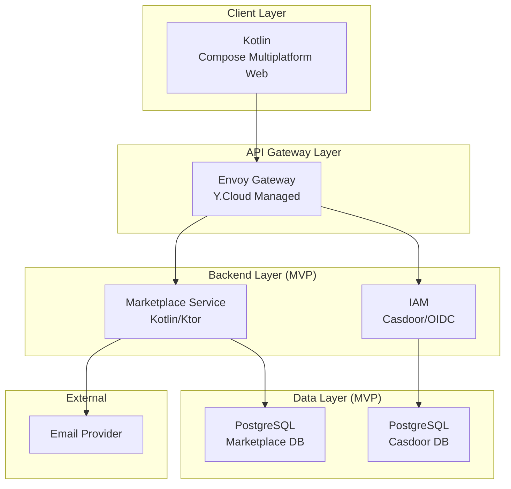
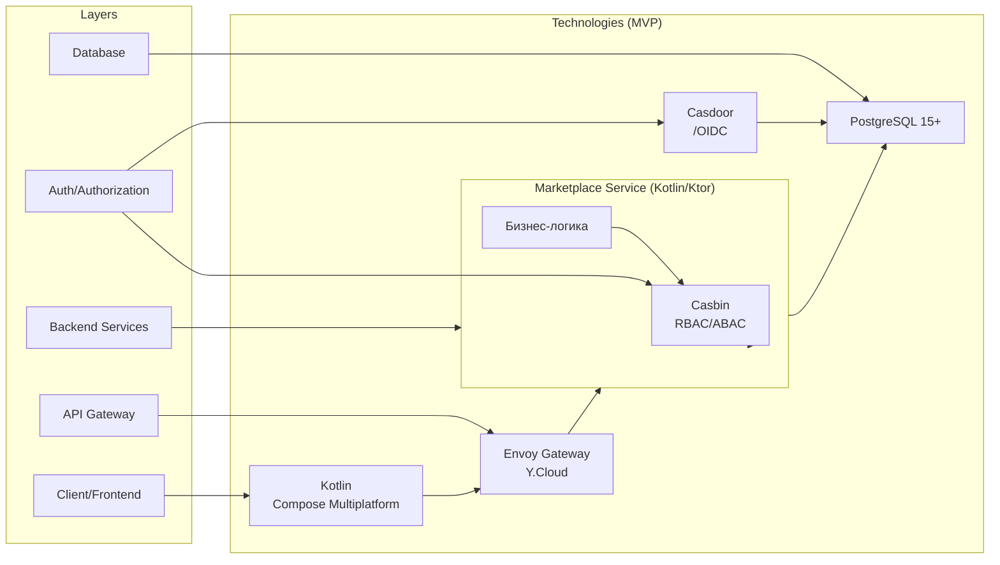
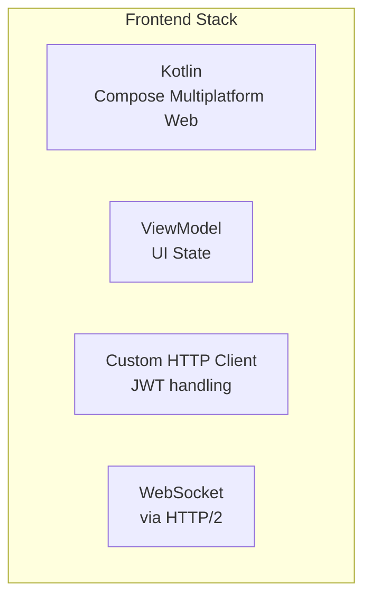
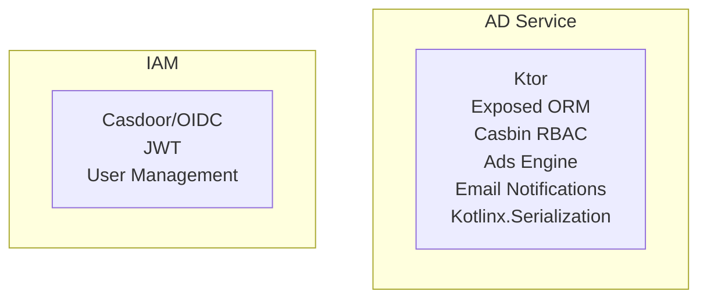
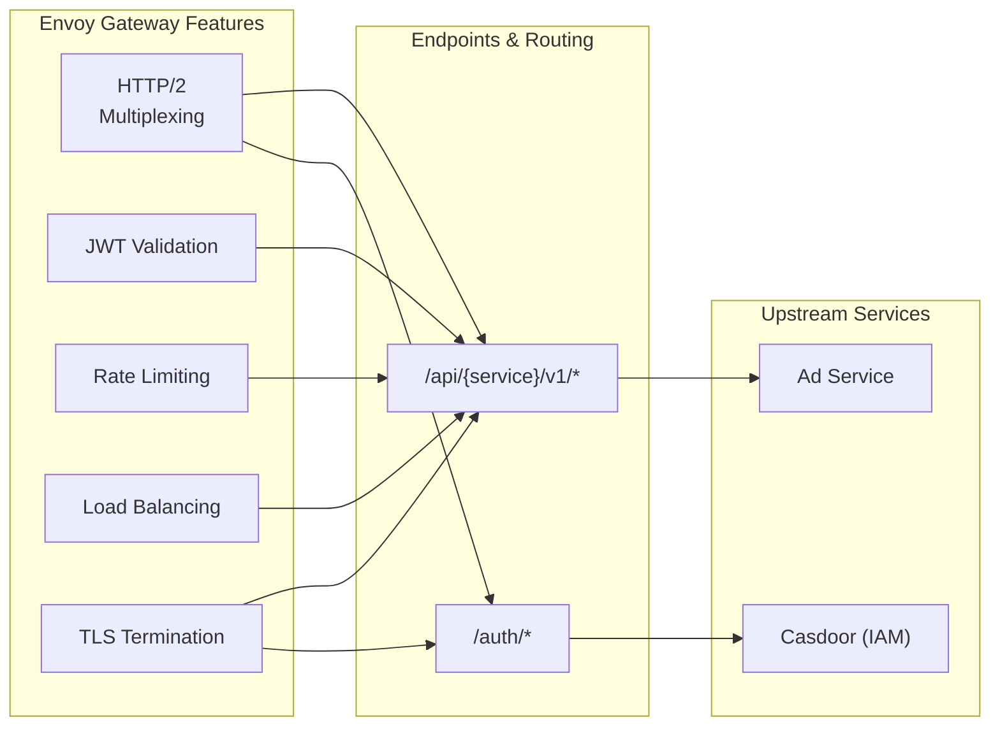
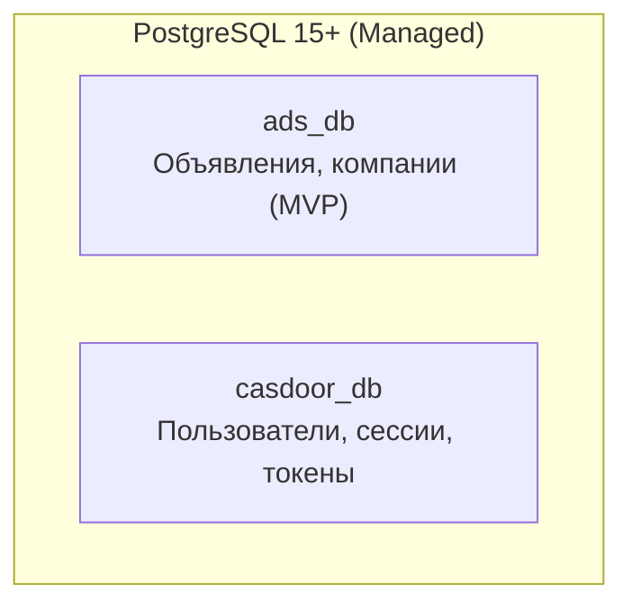
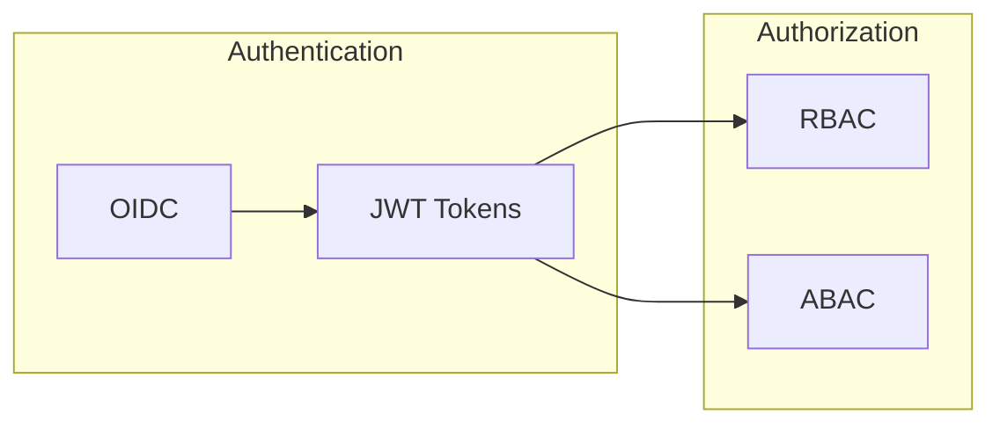
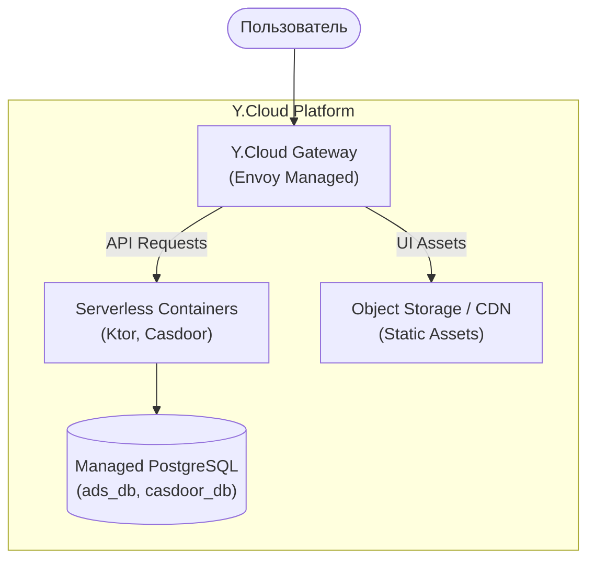
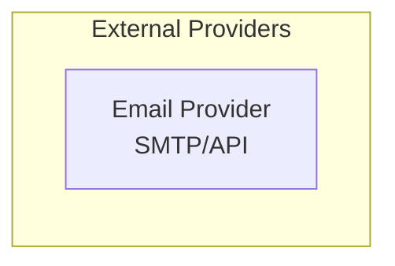
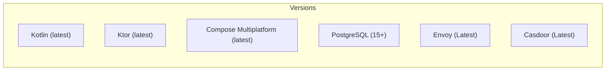

# Technology Stack — MVP

> **Status**: MVP-Optimized (2 Services)

## Overview

## Technology Stack Summary (MVP)

## Frontend

## Backend Services (MVP)

## API Gateway

## Database (MVP)

## Authentication & Authorization

## Deployment

## External Services (MVP)

## Version Information (MVP)

---

*Document Version: 2.0 (MVP)*
*Created: 2026-03-26*
*Status: Ready for review*
