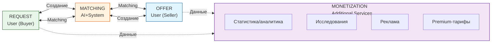

# Business Model — Бизнес-Модель

**Продукт:** B2B Маркетплейс Промышленных Компонентов  
**Версия:** 1.0  
**Статус:** Ready  
**Дата:** 2026-03-25

---

## 1. Mission (Миссия)

**Упростить закупку промышленных компонентов, соединяя проверенных поставщиков с производственными компаниями через интеллектуальную платформу без управления логистикой.**

Миссия основана на главной боли рынка: по данным исследований (AdIndex 2025, Data Insight 2025), ключевые барьеры B2B маркетплейсов — консервативный подход к выбору поставщиков, долгий цикл закупки и низкий уровень цифровизации. Мы решаем эти проблемы через специализацию и технологии matching.

---

## 2. Vision (Видение)

**К 2028 году стать ведущей B2B-платформой для торговли промышленными компонентами в России и СНГ, где каждая третья закупка моторов и электронных компонентов проходит через нашу систему.**

### Дорожная карта

| Горизонт | География | Ключевой фокус |
|----------|-----------|----------------|
| MVP (2026) | Екатеринбург + Свердловская обл. | Валидация модели, 100+ продавцов |
| Фаза 2 (2027) | Россия | Масштабирование, интеграция с 1С |
| Фаза 3 (2028) | СНГ | Экспансия, мультивалютность |
| Фаза 4 (2030+) | Глобальный | English interface, международные продавцы |

### KPI Vision

- 10,000+ активных продавцов к 2028
- 50,000+ размещённых офферов
- 100M+ GMV (годовой товарооборот)
- NPS > 60

---

## 3. Ценности Компании

| Ценность | Определение | Как проявляется |
|----------|-------------|-----------------|
| **Эффективность** | Минимум времени от запроса до сделки | 2-3 дня через matching вместо 2-4 недель |
| **Прозрачность** | Открытость цен, условий, рейтингов | Открытый каталог, верифицированные отзывы |
| **Надёжность** | Проверенные продавцы, безопасные сделки | Верификация + эскроу для крупных сделок |
| **Инновационность** | Постоянное улучшение AI-matching | ML-модели для релевантности, прогноза спроса |
| **Партнёрство** | Долгосрочные отношения с продавцами и покупателями | Персональные менеджеры, приоритетная поддержка |

---

## 4. Целевая Аудитория

### 👤 Продавцы (Offer Holders)

| Сегмент | Описание | Примеры |
|---------|----------|----------|
| **Производители моторов** | Заводы, выпускающие электродвигатели, сервоприводы | Уральский моторный завод, Электромаш |
| **Дистрибьюторы электроники** | Компании, продающие резисторы, конденсаторы, микросхемы | Компэл, Чип и Дип (опт) |
| **Специализированные поставщики** | Узкие ниши: датчики, ПЛК, приводная техника | ОВЕН, Delta Electronics |
| **Импортёры** | Поставщики зарубежных брендов (Китай, Европа) | ТД «Импорткомплект» |

**Характеристики:**
- Средний бизнес (50-500 сотрудников)
- Оборот: 50-500 млн ₽/год
- Имеют каталог, но слабо представлены онлайн
- Главная боль: сложно найти новых клиентов в своей нише

### 👤 Покупатели (Request Holders)

| Сегмент | Описание | Примеры |
|---------|----------|----------|
| **Производственные компании** | Фабрики, заводы, цеха | Машиностроительные заводы |
| **Интеграторы** | Компании, собирающие оборудование под заказ | Промышленная автоматизация |
| **Ремонтные службы** | Сервисные подразделения | РЖД, УГМК-Холдинг |
| **Мелкий бизнес** | Мастерские, небольшие производства | Локальные ремонтные цеха |

**Характеристики:**
- Закупают регулярно (10-50 заявок в месяц)
- Средний чек: 50-500 тыс. ₽
- Главная боль: поиск «где купить конкретную деталь», нет понимания рыночных цен

---

## 5. Связь с бизнес-моделью

---

## 6. Monetization (Монетизация)

| Параметр | Описание |
|----------|----------|
| **Главный принцип** | **NO COMMISSION** — мы НЕ берём % от сделок |
| **Ключевое отличие** | B2B-Center берёт 5-15%, ATI.SU 3-8%, мы — 0% |
| **Модель** | Подписки + доп. услуги (без комиссии от оборота) |
| **Документ** | Подробнее: [Monetization](monetization.md) |

### Источники дохода

| Направление | Модель | Пример |
|-------------|--------|--------|
| Подписки продавцов | Ежемесячно | Basic: ₽3K, Premium: ₽10K |
| Продвижение в поиске | Подписка | ₽3K–10K/мес |
| Верификация | Разово + поддержание | ₽10K + ₽3K/мес |
| API-доступ | Подписка | ₽20K–50K/мес |

---

*Document Version: 1.1*
*Created: 2026-03-25*
*Status: Ready*
