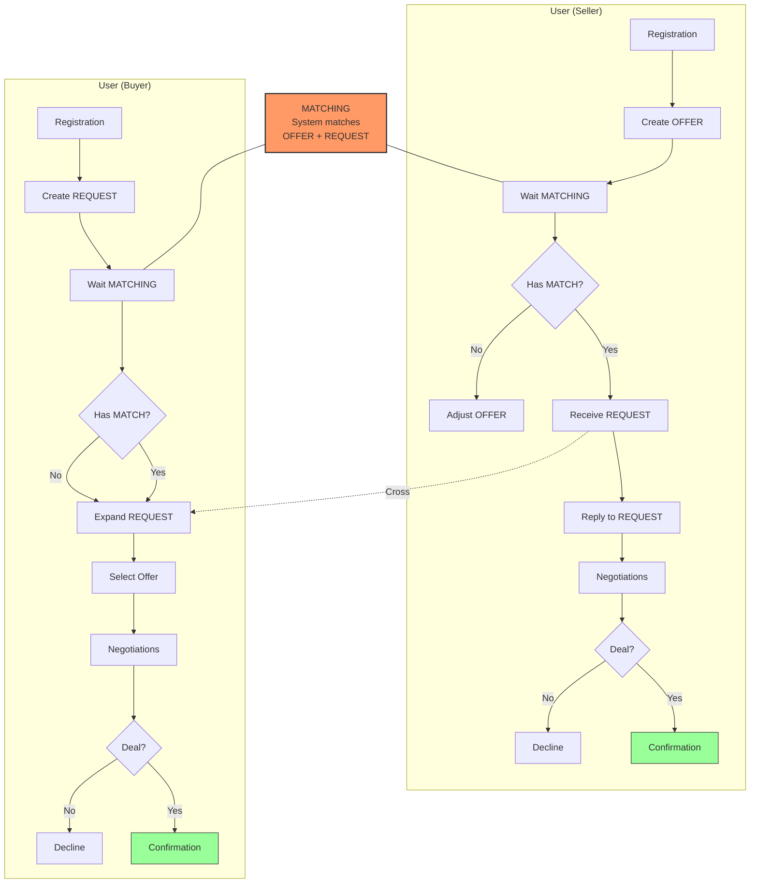
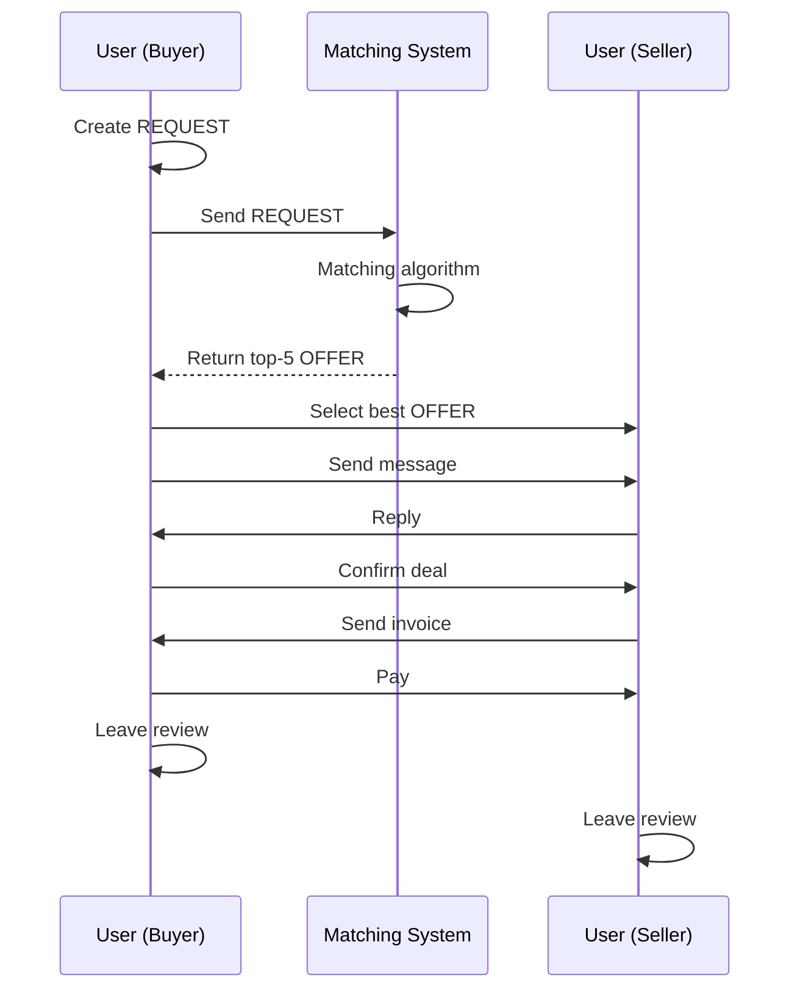

# Customer Journey Map — Карта Пути Клиента

**Продукт:** B2B Маркетплейс Промышленных Компонентов  
**Версия:** 1.0  
**Статус:** Ready  
**Дата:** 2026-03-25

---

## 1. Overview — Общая Схема

Ниже представлен путь от создания REQUEST до сделки. Один пользователь может выступать в роли продавца или покупателя. Пересечение — Matching.

---

## 2. Этапы CJM — Боли и Возможности

### Пользователь (в роли продавца)

| Этап | Действие | Боль | Возможность |
|------|----------|------|--------------|
| **1. Регистрация** | Создание аккаунта компании | Долгая верификация, много полей | Упрощённая регистрация в 1 клик |
| **2. Создание OFFER** | Загрузка карточки товара | Непонятно, какие поля обязательны | Шаблоны + подсказки + AI-заполнение |
| **3. Ожидание Matching** | Алгоритм сводит с запросами | «Алгоритм не понял, что мне нужно» | Улучшение ML-модели, seed-данные |
| **4. Получение REQUEST** | Просмотр входящих запросов | Много нерелевантных запросов | Фильтры + уточнение профиля |
| **5. Ответ на REQUEST** | Отправка КП | Нет шаблона, трачу время | Быстрые шаблоны ответов |
| **6. Переговоры** | Общение с покупателем | Нет встроенного чата, уходят в WhatsApp | Встроенный мессенджер |
| **7. Сделка** | Подтверждение, выставление счёта | Нет гарантии, что партнёр надёжен | Эскроу + рейтинг |

### Пользователь (в роли покупателя)

| Этап | Действие | Боль | Возможность |
|------|----------|------|--------------|
| **1. Регистрация** | Создание аккаунта | Долгая, непонятно зачем | Quick-start: создал — ищешь |
| **2. Создание REQUEST** | Что ищу, сколько, бюджет | Непонятно, как правильно описать | AI-подсказки, автозаполнение |
| **3. Ожидание Matching** | Алгоритм подбирает продавцов | «Никто не отвечает» | Push-уведомления, приоритет |
| **4. Получение OFFERS** | Просмотр предложений | Много нерелевантных | Рейтинг, отзывы, сортировка |
| **5. Выбор предложения** | Сравнение КП | Нет инструмента сравнения | Таблица сравнения, история |
| **6. Переговоры** | Уточнение деталей | Уходят в email/WhatsApp | Единый чат на платформе |
| **7. Сделка** | Оплата, подтверждение | Нет гарантии | Эскроу, защита платежей |

---

## 3. User Flow — Взаимодействие

---

## 4. Pain Points — Ключевые Боли

### Топ-3 Боли (в роли продавца)

| # | Боль | Глубина | Решение Платформы |
|---|------|---------|-------------------|
| 1 | Холодные звонки не работают | 🔴 High | Входящие запросы от горячих лидов |
| 2 | Не знаю, кто ищет мой товар | 🔴 High | AI-matching показывает релевантные REQUEST |
| 3 | Нет visibility | 🟡 Medium | Каталог + SEO + приоритет в поиске |

### Топ-3 Боли (в роли покупателя)

| # | Боль | Глубина | Решение Платформы |
|---|------|---------|-------------------|
| 1 | Поиск = кошмар (гуглю 2 дня) | 🔴 High | Единый каталог с фильтрами |
| 2 | Не знаю рыночную цену | 🔴 High | Прозрачные цены, открытый рынок |
| 3 | Не перезванивают, долго | 🔴 High | Matching < 2 часов, push-уведомления |

---

## 5. Metrics — Метрики Пути

| Этап | Метрика | Целевое (MVP) |
|------|---------|---------------|
| Регистрация | Время на регистрацию | < 3 мин |
| Создание REQUEST/OFFER | Время заполнения | < 2 мин |
| Matching | Время до первого матча | < 2 часа |
| Переговоры | Время до ответа | < 4 часа |
| Сделка | Конверсия из матча | > 20% |

---

## 6. MVP vs Future — Дорожная Карта

| Этап | MVP | Фаза 2 | Фаза 3 |
|------|-----|--------|--------|
| Регистрация | Email+phone | Госуслуги, 1С | Мультиязычность |
| Matching | По категории | ML, по истории | AI (NLP) |
| Чат | Текст | Файлы, фото | Видео-звонки |
| Оплата | Банковский перевод | Эскроу | Карты, крипто |
| География | Екатеринбург | РФ | СНГ |

---

*Document Version: 1.0*
*Created: 2026-03-25*
*Status: Ready*