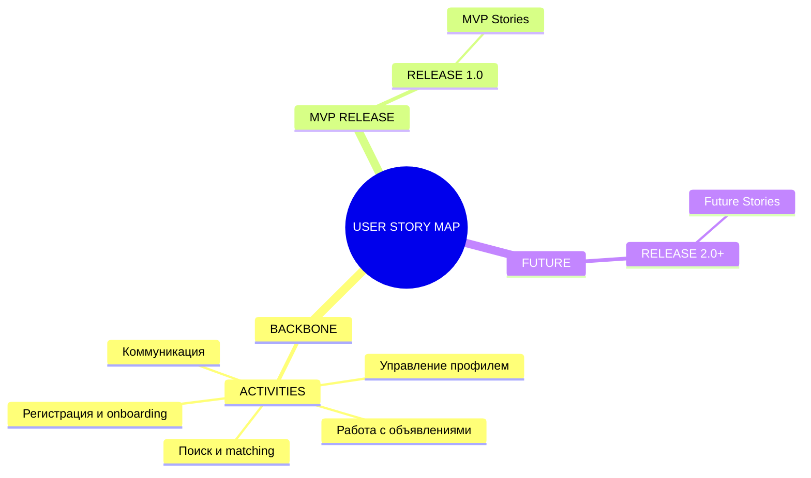
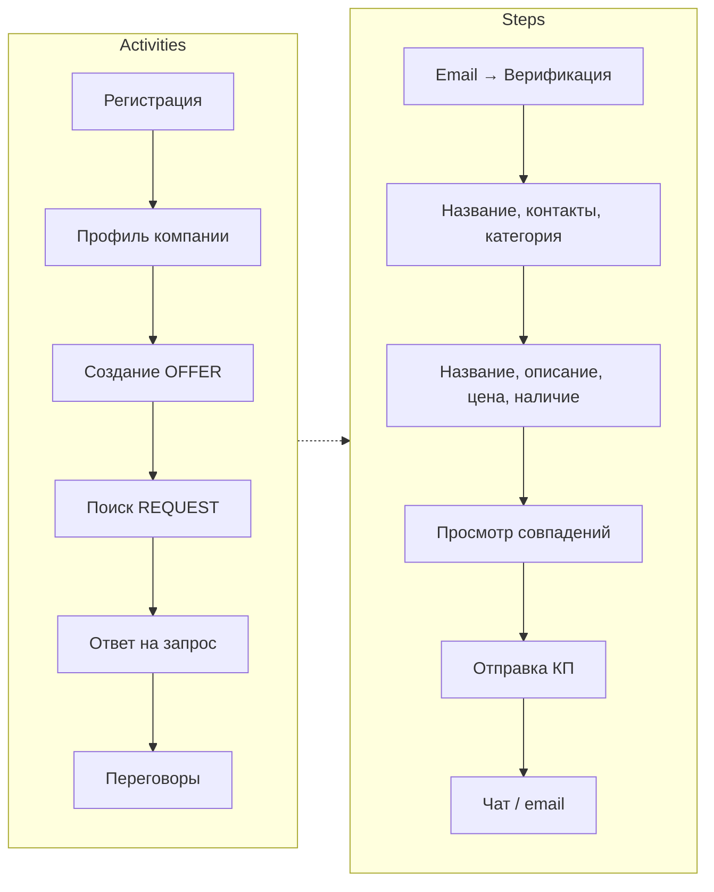
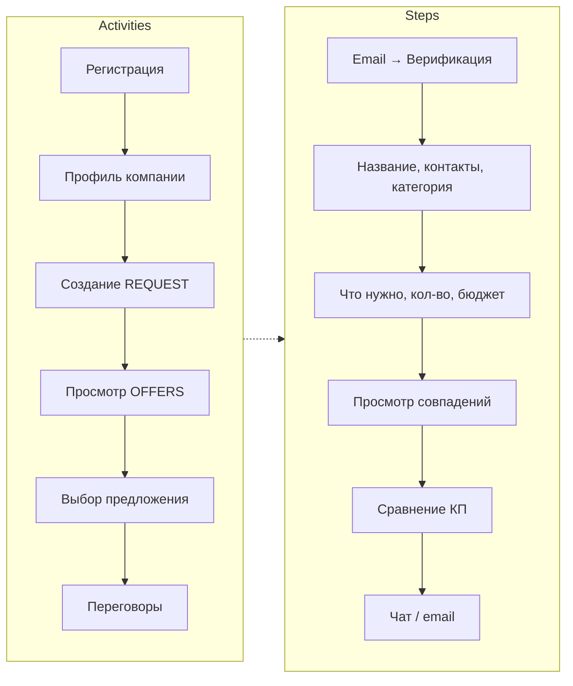
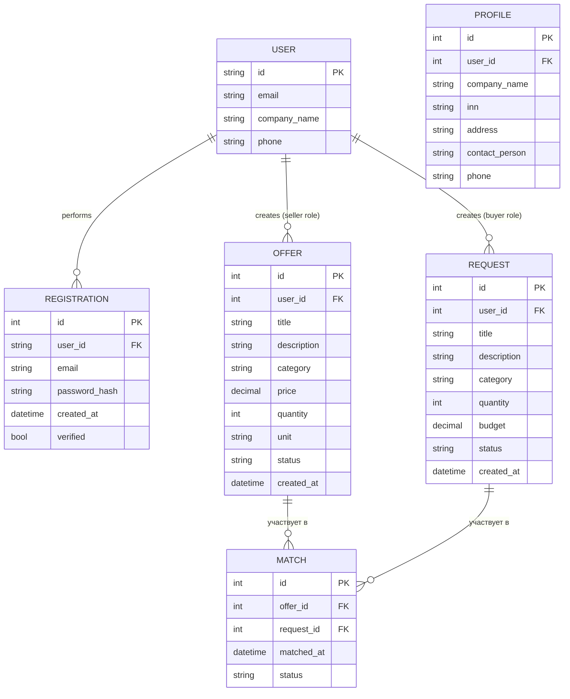
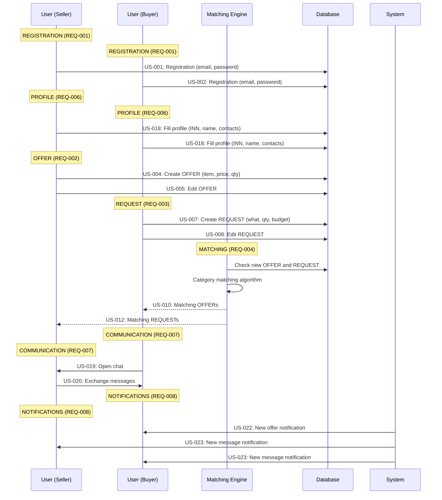

# User Story Map — MVP B2B Маркетплейс

**Продукт:** B2B Маркетплейс Промышленных Компонентов  
**Версия:** 1.0  
**Дата:** 2026-03-25  
**Статус:** Ready for Gate 1  

---

## 1. Overview

---

## 2. MVP Scope (утверждённые REQ)

| REQ | Название | Статус | Notes |
|-----|----------|--------|-------|
| **REQ-001** | Регистрация и аутентификация | ✅ MVP | Базовый вход |
| **REQ-002** | Создание OFFER | ✅ MVP | Объявления продавца |
| **REQ-003** | Создание REQUEST | ✅ MVP | Запросы покупателя |
| **REQ-004** | Matching | ✅ MVP | Email-мэтчинг в MVP |
| **REQ-005** | Каталог и поиск | ✅ MVP | Навигация |
| REQ-006 | Профиль компании и рейтинг | 🔜 Roadmap | |
| REQ-007 | Коммуникация (чат) | 🔜 Roadmap | |
| REQ-008 | Уведомления | 🔜 Roadmap | |
| REQ-009 | Монетизация | 🔜 Roadmap | |
| REQ-010 | Верификация | 🔜 Roadmap | |

---

## 3. Пользователи (User Segments)

| Сегмент | Роль | Создаёт |
|---------|------|---------|
| **Пользователь** | В роли продавца | OFFER |
| **Пользователь** | В роли покупателя | REQUEST |

---

## 4. Backbone — Activities & Steps

### Пользователь (в роли продавца)

### Пользователь (в роли покупателя)

---

## 5. User Stories — Полный Список

### MVP Release (Включаем в 1.0)

### User Stories Таблица

| ID | REQ | Описание |
|----|-----|----------|
| **US-001** | [REQ-001](./REQ-001.md) | Регистрация новой компании |
| **US-002** | [REQ-001](./REQ-001.md) | Аутентификация пользователя |
| **US-003** | [REQ-001](./REQ-001.md) | Восстановление пароля |
| **US-004** | [REQ-002](./REQ-002.md) | Создание OFFER |
| **US-005** | [REQ-002](./REQ-002.md) | Редактирование OFFER |
| **US-006** | [REQ-002](./REQ-002.md) | Деактивация OFFER |
| **US-007** | [REQ-003](./REQ-003.md) | Создание REQUEST |
| **US-008** | [REQ-003](./REQ-003.md) | Получение предложений на REQUEST |
| **US-009** | [REQ-003](./REQ-003.md) | Отмена REQUEST |
| **US-010** | [REQ-004](./REQ-004.md) | Автоматический подбор OFFER к REQUEST |
| **US-011** | [REQ-004](./REQ-004.md) | Ручной поиск по REQUEST |
| **US-012** | [REQ-004](./REQ-004.md) | Уведомление продавца о новом REQUEST |
| **US-013** | [REQ-005](./REQ-005.md) | Поиск по ключевым словам |
| **US-014** | [REQ-005](./REQ-005.md) | Фильтрация по категориям |
| **US-015** | [REQ-005](./REQ-005.md) | Сортировка результатов |
| **US-016** | [REQ-006](./REQ-006.md) | Просмотр профиля компании |
| **US-017** | [REQ-006](./REQ-006.md) | Оставление отзыва о сделке |
| **US-018** | [REQ-006](./REQ-006.md) | Редактирование профиля компании |
| **US-019** | [REQ-007](./REQ-007.md) | Инициирование чата |
| **US-020** | [REQ-007](./REQ-007.md) | Обмен сообщениями |
| **US-021** | [REQ-007](./REQ-007.md) | Прикрепление файла в чате |
| **US-022** | [REQ-008](./REQ-008.md) | Уведомление о новом предложении |
| **US-023** | [REQ-008](./REQ-008.md) | Уведомление о новом сообщении |
| **US-024** | [REQ-008](./REQ-008.md) | Уведомление о статусе сделки |
| **US-025** | [REQ-009](./REQ-009.md) | Выбор тарифа |
| **US-026** | [REQ-009](./REQ-009.md) | Просмотр доступных функций |
| **US-027** | [REQ-009](./REQ-009.md) | Автосписание за продление |
| **US-028** | [REQ-010](./REQ-010.md) | Запрос верификации |
| **US-029** | [REQ-010](./REQ-010.md) | Успешная верификация |
| **US-030** | [REQ-010](./REQ-010.md) | Отклонение верификации |

### Future Stories (Релиз 2.0+)

| ID | Пользователь | Activity | Story | Условие |
|----|--------------|----------|-------|---------|
| **US-014** | Пользователь (продавец) | Профиль | Загрузка логотипа и документов | Рост базы |
| **US-015** | Пользователь (покупатель) | Профиль | Загрузка логотипа и документов | Рост базы |
| **US-016** | Система | Matching | AI-уведомления о новых совпадениях (Smart Alerts) | MVP подтверждён |
| **US-017** | Пользователь (продавец) | OFFER | Массовая загрузка OFFER (импорт из CSV) | >100 OFFER |
| **US-018** | Пользователь (покупатель) | REQUEST | Шаблоны часто используемых запросов | >50 REQUEST |
| **US-019** | Пользователь | Чат | Встроенный чат на платформе | Трафик |
| **US-020** | Пользователь | Рейтинг | Система отзывов и рейтингов | >100 сделок |
| **US-021** | Система | Lead Gen | AI-подбор потенциальных клиентов | Подтверждён PMF |

---

## 5. MVP Release — Release 1.0

### Критерии MVP

| Критерий | Описание |
|----------|----------|
| **Цель** | Демонстрация ценности инвесторам, получение фидбека |
| **Время на разработку** | 4-6 недель |
| **Количество фич** | 30 User Stories (US-001...US-030) |
| **Пользователи** | Пользователь (может быть в роли продавца или покупателя) |

### MVP Stories (Включены)

```mermaid
graph TB
    subgraph MVP["MVP Release 1.0"]
        direction TB
        
        subgraph AUTH["Регистрация & Аутентификация"]
            US1[US-001 → US-003]
        end
        
        subgraph PROFILE["Профиль & Рейтинг"]
            US2[US-016 → US-018]
        end
        
        subgraph OFFER["OFFER (Продажа)"]
            US3[US-004 → US-006]
        end
        
        subgraph REQUEST["REQUEST (Покупка)"]
            US4[US-007 → US-009]
        end
        
        subgraph MATCHING["Matching"]
            US5[US-010 → US-012]
        end
        
        subgraph SEARCH["Каталог & Поиск"]
            US6[US-013 → US-015]
        end
        
        subgraph CHAT["Коммуникация"]
            US7[US-019 → US-021]
        end
        
        subgraph NOTIFICATIONS["Уведомления"]
            US8[US-022 → US-024]
        end
        
        subgraph MONETIZATION["Монетизация"]
            US9[US-025 → US-027]
        end
        
        subgraph VERIFICATION["Верификация"]
            US10[US-028 → US-030]
        end
    end
    
    style MVP fill:#e1f5fe,stroke:#01579b,stroke-width:2px
    style AUTH fill:#c8e6c9,stroke:#2e7d32
    style PROFILE fill:#c8e6c9,stroke:#2e7d32
    style OFFER fill:#fff9c4,stroke:#f57f17
    style REQUEST fill:#fff9c4,stroke:#f57f17
    style MATCHING fill:#ffccbc,stroke:#d84315
    style SEARCH fill:#ffccbc,stroke:#d84315
    style CHAT fill:#d1c4e9,stroke:#4527a0
    style NOTIFICATIONS fill:#d1c4e9,stroke:#4527a0
    style MONETIZATION fill:#b2dfdb,stroke:#00695c
    style VERIFICATION fill:#b2dfdb,stroke:#00695c
```

### Ссылка на детали

Полный список User Stories с деталями и Acceptance Criteria доступен в:
- [REQ-001](./REQ-001.md) — US-001...US-003
- [REQ-002](./REQ-002.md) — US-004...US-006
- [REQ-003](./REQ-003.md) — US-007...US-009
- [REQ-004](./REQ-004.md) — US-010...US-012
- [REQ-005](./REQ-005.md) — US-013...US-015
- [REQ-006](./REQ-006.md) — US-016...US-018
- [REQ-007](./REQ-007.md) — US-019...US-021
- [REQ-008](./REQ-008.md) — US-022...US-024
- [REQ-009](./REQ-009.md) — US-025...US-027
- [REQ-010](./REQ-010.md) — US-028...US-030

---

## 6. Workflow — Поток Данных

---

## 7. Out-of-the-Box Идея

> **Идея для привлечения первых пользователей:**
> 
> **"First Deal Guarantee"** — платформа гарантирует первую сделку:
> - Если пользователь (в роли продавца) создал 3+ OFFER и получил 0 ответов за 14 дней → платформа сама находит ему 1 клиента вручную
> - Если пользователь (в роли покупателя) создал 3+ REQUEST и получил 0 OFFER за 14 дней → платформа ищет поставщика вручную
> 
> **Почему работает:**
> - Решает скептицизм "платформа не работает"
> - Даёт время алгоритму набрать данные
> - Показывает commitment команды

---

## 8. Риски MVP

| Риск | Вероятность | Влияние | Митигация |
|------|-------------|---------|-----------|
| Нет liquidity (пустой marketplace) | High | High | Seed-данные, manual matching |
| Matching не работает | Medium | High | Простой алгоритм по категории |
| Нет доверия (отзывы) | Medium | Medium | Профиль компании, ИНН |
| Пользователи не понимают flow | Low | High | Onboarding, подсказки |

---

## 9. Definition of Done (MVP)

- [ ] Регистрация работает (email + password) — [REQ-001](./REQ-001.md)
- [ ] Профиль компании заполняется — [REQ-006](./REQ-006.md)
- [ ] OFFER создаётся и отображается в каталоге — [REQ-002](./REQ-002.md)
- [ ] REQUEST создаётся и отображается — [REQ-003](./REQ-003.md)
- [ ] Matching работает (простой по категории) — [REQ-004](./REQ-004.md)
- [ ] Видно совпадения (пользователь в роли покупателя видит OFFERS, в роли продавца видит REQUEST) — [REQ-004](./REQ-004.md)
- [ ] Можно посмотреть контакт (email) — [REQ-007](./REQ-007.md)
- [ ] UI минимально рабочий (web) — [REQ-005](./REQ-005.md)
- [ ] Уведомления работают — [REQ-008](./REQ-008.md)

---

*Document Version: 1.0*  
*Created: 2026-03-25*  
*Status: Ready for Gate 1 Review*
