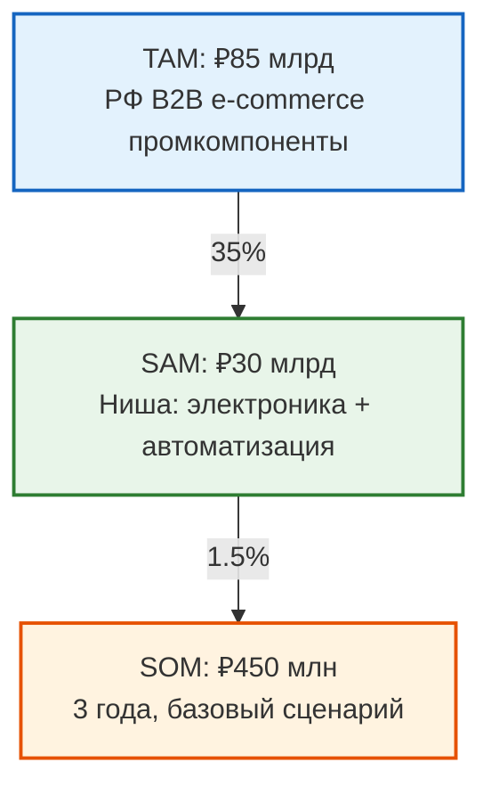

# TAM/SAM/SOM — Анализ Рынка

**Продукт:** B2B Маркетплейс Промышленных Компонентов  
**Версия:** 2.0  
**Статус:** Ready  
**Дата:** 2026-03-25

---

## 1. TAM (Total Addressable Market) — Общий Рынок

### Определение
Российский рынок B2B торговли промышленными компонентами (моторы, датчики, ПЛК, приводы, электроника).

### Источники данных
- **Росстат** — Промышленное производство РФ, обрабатывающая промышленность
- **Data Insight** — B2B e-commerce в России 2024–2025
- **RU-102** — Реестр промышленных предприятий России

### Метрика TAM

| Параметр | Значение | Источник |
|----------|----------|----------|
| Объём рынка промкомпонентов в РФ | **₽950 млрд/год** | Росстат 2024, ОКВЭД 27–29 |
| Рынок B2B e-commerce (промышленность) | **₽85 млрд** | Data Insight 2025 |
| CAGR B2B e-commerce | 18% | Data Insight прогноз |

### Обоснование

По данным **Росстата** (2024), объём обрабатывающей промышленности России составляет ~₽45 трлн/год. Промышленные компоненты (электрооборудование, электроника, автоматизация) составляют ~2.1% → ~₽950 млрд.

По оценкам **Data Insight**, проникновение B2B e-commerce в промышленности России составляет ~9% (против 15% в ЕС), что даёт TAM в ₽85 млрд.

---

## 2. SAM (Serviceable Addressable Market) — Доступный Рынок

### Определение
Рынок, который мы можем обслуживать с учётом ниши: Россия, промышленные компоненты, электроника и автоматизация.

### Географический фокус

| Регион | Доля промпроизводства | Обоснование |
|--------|----------------------|-------------|
| Россия (всего) | 100% | Основной рынок |
| в т.ч. УрФО | 15% | Промышленный хаб (Екб, Челябинск, Тюмень) |
| в т.ч. ЦФО | 28% | Москва, промышленные кластеры |
| в т.ч. ПФО | 18% | Казань, Самара, Уфа |
| в т.ч. СЗФО | 12% | С-Пб, Ленинградская обл. |
| СНГ | — | Целевая экспансия с 2027 |

**Источник:** Росстат, региональная статистика 2024

### Метрика SAM

| Параметр | Значение | Методология |
|----------|----------|-------------|
| TAM (B2B e-commerce промкомпоненты) | ₽85 млрд | Data Insight 2025 |
| Нишевой коэффициент (фокус на электронику/автоматизацию) | 35% | Оценка: 35% рынка — наша ниша |
| **SAM** | **₽30 млрд** | TAM × нишевой коэффициент |

### Обоснование

По данным **B2B-Center** и **ATI.SU**, объём электронных компонентов и средств автоматизации составляет ~35% от общего рынка промышленных закупок. Фокусируясь на этой нише, мы получаем SAM ≈ ₽30 млрд.

---

## 3. SOM (Serviceable Obtainable Market) — Реалистичный Рынок

### Определение
Доля рынка, которую мы можем реально захватить за 3 года с учётом ресурсов и конкуренции.

### Конкурентный ландшафт

| Платформа | Доля рынка B2B e-commerce | Фокус |
|-----------|---------------------------|-------|
| B2B-Center | ~40% | Универсальный, тендеры |
| ATI.SU | ~25% | Автозапчасти, грузовики |
| Югара | ~10% | Стройматериалы |
| Отраслевые (отдельные) | ~25% | Узкие ниши |

**Источник:** Data Insight, оценка рынка 2025

### Сценарное планирование

| Сценарий | Доля SAM | Выручка к 2028 | Условия |
|----------|----------|---------------|---------|
| Консервативный | 0.5% | ₽150 млн | Только Екб, 150 продавцов |
| Базовый | 1.5% | ₽450 млн | РФ, 500 продавцов |
| Оптимистичный | 3% | ₽900 млн | РФ + СНГ, 1,500 продавцов |

### Выбор SOM

| Параметр | Значение | Обоснование |
|----------|----------|-------------|
| **SOM (базовый сценарий)** | **₽450 млн** | Реалистичный захват 1.5% рынка за 3 года |
| Период | 2026–2028 | Roadmap из Business Model |
| Целевая доля SAM | 1.5% | Учитывает конкурентов (B2B-Center, ATI.SU) |

### Допущения
1. Конверсия продавцов: 20% от охваченных компаний
2. Средний чек сделки: ₽150,000
3. Количество сделок на продавца: 15/мес к 2028
4. Без учёта расширения в другие категории
5. Валюта: рубли (₽) — отчётность в российских реалиях

---

## 4. Визуализация

---

## 5. Ключевые выводы

| Метрика | Значение | Бизнес-импакт |
|---------|----------|---------------|
| TAM/SAM ratio | 2.8x | Фокус на нишу оправдан |
| SAM/SOM ratio | 67x | Долгосрочный рост без смены модели |
| TAM/SOM ratio | 189x | Рынок значительный — начать локально |
| Срок до ₽450M | 3 года | Реалистичный timeline |

### Источники

| # | Источник | Ссылка |
|---|----------|--------|
| 1 | Росстат — Промышленное производство 2024 | https://rosstat.gov.ru |
| 2 | Data Insight — B2B e-commerce Russia 2025 | https://datainsight.ru |
| 3 | B2B-Center — О платформе | https://www.b2b-center.ru/about/ |
| 4 | ATI.SU — О платформе | https://ati.su/about/ |
| 5 | RU-102 — Реестр промпредприятий | https://ru102.ru |

### Следующие шаги
- Уточнять SAM по мере запуска MVP (валидация через реальные метрики)
- Пересчитывать SOM ежеквартально на основе фактических данных
- Планировать выход на соседние ниши (инструменты, химия) после 2028

---

*Document Version: 2.0*
*Updated: 2026-03-25*
*Status: Ready*